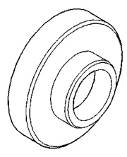
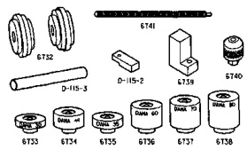
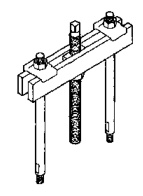
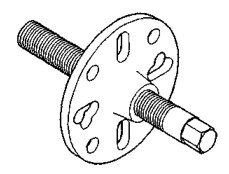
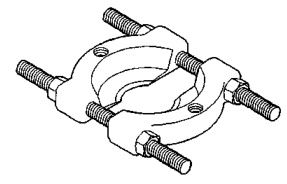
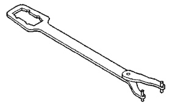
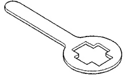

# DIFFERENTIAL AND DRIVELINE 3-153

## SPECIAL TOOLS (Continued)

*Fig. 1 Installer, Seal—8152*

*Fig. 2 Gauge, Pinion Depth Setting—6730*
- 6730 Pinion Height Set

*Fig. 3 Puller—938*

*Fig. 4 Puller—C-452*

*Fig. 5 Splitter, Bearing—1130*

*Fig. 6 Wrench—C-3281*

*Fig. 7 Holder, Yoke—6719*

*Fig. 8 Dial Indicator Set—C-3339*
