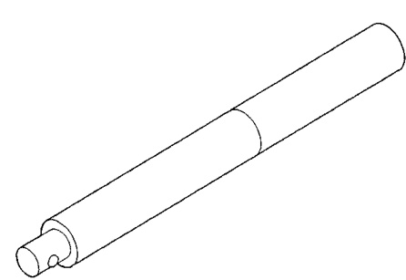
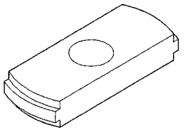
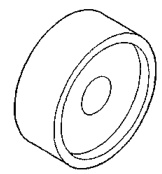
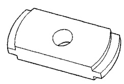
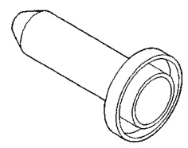
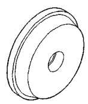
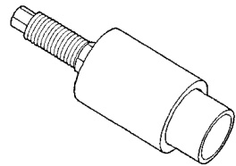
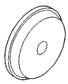

# DIFFERENTIAL AND DRIVELINE 3-154

## SPECIAL TOOLS (Continued)

*Fig. 1 Handle—C-4171*

*Fig. 2 Remover, Bearing Cup—C-4307*

*Fig. 3 Installer, Differential Bearing—C-4190*

*Fig. 4 Remover, Pinion Bearing Cup—D-159*

*Fig. 5 Installer, Bearing Cup—C-4308*

*Fig. 6 Installer, Pinion Seal—D-187-B*

*Fig. 7 Installer, Rear Bearing Cup—C-4204*

*Fig. 8 Installer, Pinion Yoke—D-191*
