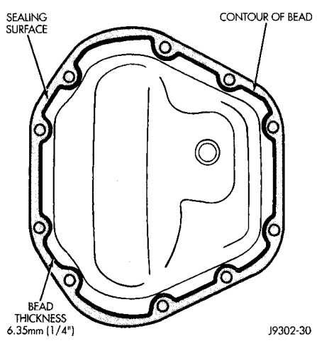

# DIFFERENTIAL AND DRIVELINE 3-24

## SERVICE PROCEDURES

### LUBRICANT CHANGE

(1) Raise and support the vehicle.

(2) Remove the lubricant fill hole plug from the differential housing cover.

(3) Remove the differential housing cover and drain the lubricant from the housing.

(4) Clean the housing cavity with a flushing oil, light engine oil or lint free cloth. Do not use water, steam, kerosene or gasoline for cleaning.

(5) Remove the sealant from the housing and cover surfaces. Use solvent to clean the mating surfaces.

(6) Apply a bead of Mopar® Silicone Rubber Sealant, or equivalent, to the housing cover (Fig. 6).

*Fig. 6 Typical Housing Cover With Sealant*

Install the housing cover within 5 minutes after applying the sealant.

(7) Install the cover and any identification tag. Tighten the cover bolts in a criss-cross pattern to 41 N·m (30 ft. lbs.) torque.

(8) Refill the differential with Mopar® Hypoid Gear Lubricant, or equivalent, to bottom of the fill plug hole. Refer to the Lubricant Specifications in this group for the quantity necessary.

(9) Install the fill hole plug and lower the vehicle.

---

## REMOVAL AND INSTALLATION

### AXLE ASSEMBLY

#### REMOVAL

(1) Raise and support the vehicle.

(2) Remove the wheels and tires.

(3) Remove the brake calipers and rotors. Refer to Group 5, Brakes, for proper procedures.

(4) Remove ABS wheel speed sensors, if equipped. Refer to Group 5, Brakes, for proper procedures.

(5) Disconnect the axle vent hose.

(6) Disconnect vacuum hose and electrical connector at disconnect housing.

(7) Remove the front propeller shaft.

(8) Disconnect the stabilizer bar links at the axle brackets.

(9) Disconnect the shock absorbers from axle brackets.

(10) Disconnect the track bar from the axle bracket.

(11) Disconnect the tie rod and drag link from the steering knuckles.

(12) Position the axle with a suitable lifting device under the axle assembly.

(13) Secure axle to lifting device.

(14) Mark suspension alignment cams for installation reference.

(15) Disconnect the upper and lower suspension arms from the axle bracket.

(16) Lower the axle. The coil springs will drop with the axle.

(17) Remove the coil springs from the axle bracket.

#### INSTALLATION

> **CAUTION:** Suspension components with rubber bushings should be tightened with the weight of the vehicle on the suspension, at normal height. If springs are not at their normal ride position, vehicle ride comfort could be affected and premature bushing wear may occur. Rubber bushings must never be lubricated.

(1) Support the axle on a suitable lifting device.

(2) Secure axle to lifting device.

(3) Position the axle under the vehicle.

(4) Install the springs, retainer clip and bolts.

(5) Raise the axle and align it with the spring pads.

(6) Position the upper and lower suspension arms in the axle brackets. Install bolts, nuts and align the suspension alignment cams to the reference marks. Do not tighten at this time.

(7) Connect the track bar to the axle bracket and install the bolt. Do not tighten at this time.
