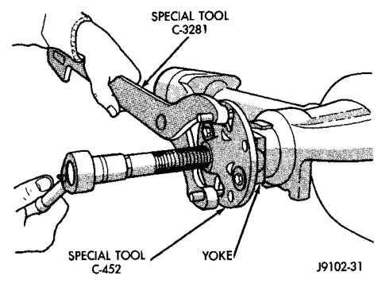
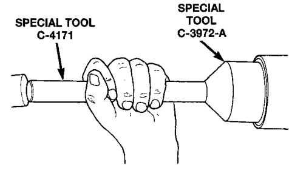

# DIFFERENTIAL AND DRIVELINE 3-25

## REMOVAL AND INSTALLATION (Continued)

(8) Install the shock absorber and tighten bolts to 121 N·m (89 ft. lbs.) torque.

(9) Install the stabilizer bar link to the axle bracket. Tighten the nut to 37 N·m (27 ft. lbs.) torque.

(10) Install the drag link and tie rod to the steering knuckles and tighten the nuts to 88 N·m (65 ft. lbs.) torque.

(11) Install the ABS wheel speed sensors, if equipped. Refer to Group 5, Brakes, for proper procedures.

(12) Install the brake calipers and rotors. Refer to Group 5, Brakes, for proper procedures.

(13) Connect the vent hose to the tube fitting.

(14) Connect vacuum hose and electrical connector to disconnect housing.

(15) Install front propeller shaft.

(16) Check and add differential lubricant, if necessary. Refer to Lubricant Specifications in this section for lubricant requirements.

(17) Install the wheel and tire assemblies.

(18) Remove the supports and lower the vehicle.

(19) Tighten the upper suspension arm nuts at axle to 121 N·m (89 ft. lbs.) torque. Tighten the upper suspension arm nuts at frame to 84 N·m (62 ft. lbs.) torque.

(20) Tighten the lower suspension arm nuts at axle to 84 N·m (62 ft. lbs.) torque. Tighten the lower suspension arm nuts at frame to 119 N·m (88 ft. lbs.) torque.

(21) Tighten the track bar bolt at the axle bracket to 176 N·m (130 ft. lbs.) torque.

(22) Check the front wheel alignment.

---

### PINION SHAFT SEAL—216 FBI AXLE

#### REMOVAL

(1) Raise and support the vehicle.

(2) Remove wheel and tire assemblies.

(3) Remove brake calipers and rotors.

(4) Mark the propeller shaft and pinion yoke for installation reference.

(5) Remove the propeller shaft from the yoke.

(6) Rotate the pinion gear three or four times.

(7) Measure the amount of torque necessary to rotate the pinion gear with a (in. lbs.) dial-type torque wrench. Record the torque reading for installation reference.

(8) Remove the pinion yoke nut and washer. Use Remover C-452 and Wrench C-3281 to remove the pinion yoke (Fig. 7).

*Fig. 7 Pinion Yoke Removal*

(9) Use suitable pry tool or slide hammer mounted screw to remove the pinion shaft seal.

#### INSTALLATION

(1) Apply a light coating of gear lubricant on the lip of pinion seal. Install seal with Installer C-3972-A and Handle C-4171 (Fig. 8).

*Fig. 8 Pinion Seal Installation*

(2) Install yoke on the pinion gear with Installer W-162-D (Fig. 9).

> **CAUTION:** Do not exceed the minimum tightening torque when installing the pinion yoke retaining nut. Damage to collapsible spacer or bearings may result.

(3) Install a new nut on the pinion gear. Tighten the nut only enough to remove the shaft end play.

(4) Rotate the pinion shaft using a (in. lbs.) torque wrench. Rotating torque should be equal to the reading recorded during removal, plus an additional 0.56 N·m (5 in. lbs.) (Fig. 10).

(5) If the rotating torque is too low, use Holder 6719 to hold the pinion yoke (Fig. 11), and tighten the pin-
