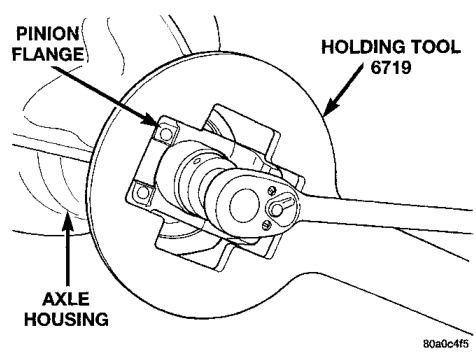
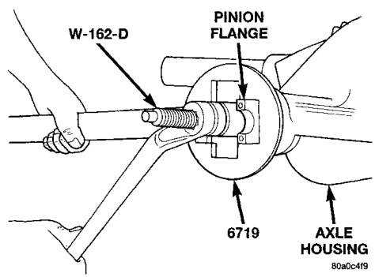
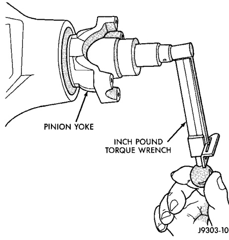
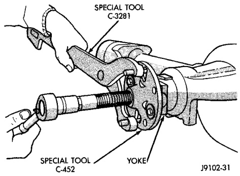

# DIFFERENTIAL AND DRIVELINE 3-26

## REMOVAL AND INSTALLATION (Continued)

*Fig. 10 Install Pinion Yoke*

*Fig. 9 Check Pinion Rotation Torque*

ion shaft nut in 6.8 N·m (5 ft. lbs.) until proper rotating torque is achieved.

(6) Align the installation reference marks and attach the propeller shaft to the yoke.

(7) Check and add lubricant to axle, if necessary. Refer to Lubricant Specifications in this section for lubricant requirements.

(8) Install brake rotors and calipers.

(9) Install wheel and tire assemblies.

(10) Lower the vehicle.

---

### PINION SHAFT SEAL—248 FBI AXLE

#### REMOVAL

(1) Raise and support the vehicle.

(2) Remove wheel and tire assemblies.

*Fig. 11 Tightening Pinion Shaft Nut*

(3) Remove brake calipers and rotors.

(4) Mark the propeller shaft and pinion yoke for installation reference.

(5) Remove the propeller shaft from the yoke.

(6) Rotate the pinion gear three or four times.

(7) Measure the amount of torque necessary to rotate the pinion gear with a (in. lbs.) dial-type torque wrench. Record the torque reading for installation reference.

(8) Remove the pinion yoke nut and washer. Use Remover C-452 and Wrench C-3281 to remove the pinion yoke (Fig. 12).

*Fig. 12 Pinion Yoke Removal*

(9) Use suitable pry tool or slide hammer mounted screw to remove the pinion shaft seal.

#### INSTALLATION

(1) Apply a light coating of gear lubricant on the lip of pinion seal. Install seal with Installer 8108 and Handle C-4171 (Fig. 13).

(2) Install yoke on the pinion gear with Installer C-3718 and Holder 6719 (Fig. 14).
