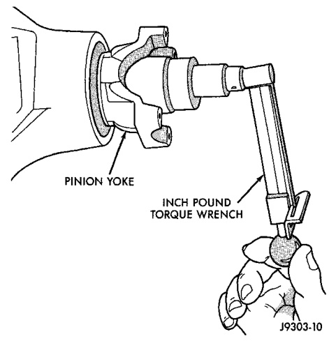
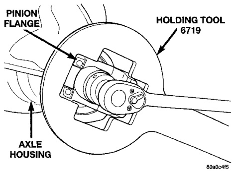
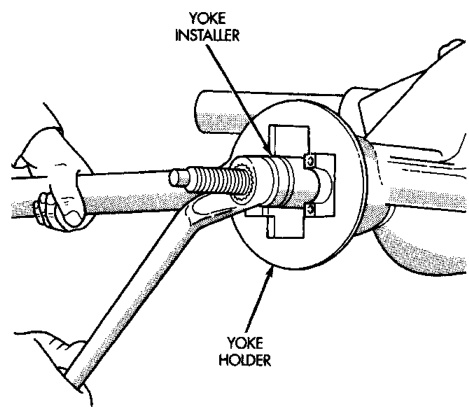
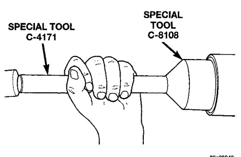

# DIFFERENTIAL AND DRIVELINE 3-27

## REMOVAL AND INSTALLATION (Continued)

*Fig. 13 Pinion Seal Installation*

> **CAUTION:** Do not exceed the minimum tightening torque when installing the pinion yoke retaining nut. Damage to collapsible spacer or bearings may result.

(3) Install a new nut on the pinion gear. Tighten the nut only enough to remove the shaft end play.

(4) Rotate the pinion shaft using a (in. lbs.) torque wrench. Rotating torque should be equal to the reading recorded during removal, plus an additional 0.56 N·m (5 in. lbs.) (Fig. 15).

*Fig. 14 Install Pinion Yoke*

(5) If the rotating torque is too low, use Holder 6719 to hold the pinion yoke (Fig. 16), and tighten the pinion shaft nut in 6.8 N·m (5 ft. lbs.) until proper rotating torque is achieved.

*Fig. 16 Check Pinion Rotation Torque*

*Fig. 15 Tightening Pinion Shaft Nut*

(6) Align the installation reference marks and attach the propeller shaft to the yoke.

(7) Check and add lubricant to axle, if necessary. Refer to Lubricant Specifications in this section for lubricant requirements.

(8) Install brake rotors and calipers.

(9) Install wheel and tire assemblies.

(10) Lower the vehicle.

---

### AXLE SHIFT MOTOR

#### REMOVAL

(1) Disconnect the vacuum and wiring connector from the shift housing.

(2) Remove indicator switch.
