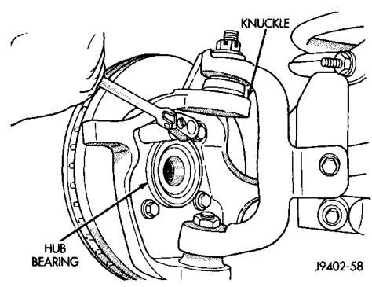
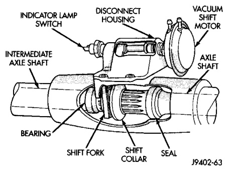

# DIFFERENTIAL AND DRIVELINE 3-28

## REMOVAL AND INSTALLATION (Continued)

(3) Remove the shift motor housing cover, gasket and shield from the housing (Fig. 17).

*Fig. 17 Shift Motor Housing*

### INSTALLATION

(1) Install the shift motor housing gasket and cover. Ensure the shift fork is correctly guided into the shift collar groove.

(2) Install the shift motor housing shield and attaching bolts. Tighten the bolts to 11 N·m (96 in. lbs.) torque.

(3) Add 148 ml (5 ounces) of API grade GL 5 hypoid gear lubricant to the shift motor housing. Add lubricant through indicator switch mounting hole.

(4) Install indicator switch, electrical connector and vacuum harness.

---

### HUB BEARING AND AXLE SHAFT

#### REMOVAL

(1) Raise and support the vehicle.

(2) Remove the wheel and tire assembly.

(3) Remove the brake caliper and rotor. Refer to Group 5, Brakes, for proper procedures.

(4) Remove ABS wheel speed sensor, if equipped. Refer to Group 5, Brakes, for proper procedures.

(5) Remove the cotter pin and axle hub nut.

(6) Remove the hub to knuckle bolts (Fig. 18). Remove the hub bearing from the steering knuckle and axle shaft.

(7) Remove the brake dust shield.

(8) Remove the axle shaft from the housing. Avoid damaging the axle shaft oil seal.

#### INSTALLATION

(1) Clean the axle shaft and apply a thin film of Mopar® Wheel Bearing Grease to the shaft splines, seal contact surface, hub bore.

(2) Install the axle shaft into the housing and differential side gears. Avoid damaging the axle shaft oil seals in the differential.

*Fig. 18 Hub and Knuckle*

(3) Install dust shield and hub bearing on knuckle, and axle shaft.

(4) Install the hub bearing to knuckle bolts and tighten to 170 N·m (125 ft. lbs.) torque.

(5) Install the axle washer and nut, tighten nut to 237 N·m (175 ft. lbs.) torque. Align nut to next cotter pin hole and install new cotter pin.

(6) Install ABS wheel speed sensor. Refer to Group 5, Brakes, for proper procedures.

(7) Install the brake rotor and caliper. Refer to Group 5, Brakes, for proper procedures.

(8) Install the wheel and tire assembly.

(9) Remove support and lower the vehicle.

---

### AXLE SHAFT—CARDAN U-JOINT

Single cardan U-joint components are not serviceable. If defective, they must be replaced as a unit. If the bearings, seals, spider, or bearing caps are damaged or worn, replace the complete U-joint.

#### REMOVAL

> **CAUTION:** Clamp only the narrow forged portion of the yoke in the vise. Also, to avoid distorting the yoke, do not over tighten the vise jaws.

(1) Remove axle shaft.

(2) Remove the bearing cap retaining snap rings (Fig. 19).

It can be helpful to saturate the bearing caps with penetrating oil prior to removal.

(3) Locate a socket where the inside diameter is larger in diameter than the bearing cap. Place the socket (receiver) against the yoke and around the perimeter of the bearing cap to be removed.

(4) Locate a socket where the outside diameter is smaller in diameter than the bearing cap. Place the socket (driver) against the opposite bearing cap.
