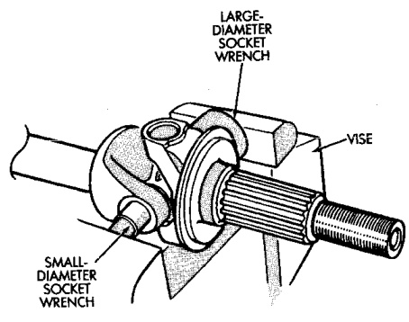
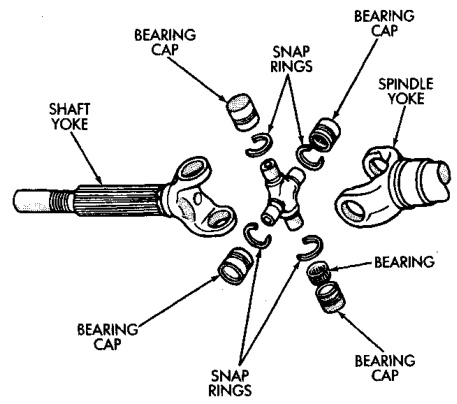

# DIFFERENTIAL AND DRIVELINE 3-29

## REMOVAL AND INSTALLATION (Continued)

*Fig. 20 Axle Shaft Outer U-Joint*

(5) Position the yoke with the sockets in a vise (Fig. 20).

*Fig. 19 Yoke Bearing Cap Removal*

(6) Compress the vise jaws to force the bearing cap into the larger socket (receiver).

(7) Release the vise jaws. Remove the sockets and bearing cap that was partially forced out of the yoke.

(8) Repeat the above procedure for the remaining bearing cap.

(9) Remove the remaining bearing cap, bearings, seals and spider from the propeller shaft yoke.

#### INSTALLATION

(1) Pack the bearing caps 1/3 full of wheel bearing lubricant. Apply extreme pressure (EP), lithium-base lubricant to aid in installation.

(2) Position the spider in the yoke. Insert the seals and bearings. Tap the bearing caps into the yoke bores far enough to hold the spider in position.

(3) Place the socket (driver) against one bearing cap. Position the yoke with the socket wrench in a vise.

(4) Compress the vise to force the bearing caps into the yoke. Force the caps enough to install the retaining clips.

(5) Install the bearing cap retaining clips.

(6) Install axle shaft.

---

### STEERING KNUCKLE—216 FBI AXLE

#### REMOVAL

(1) Remove hub bearing and axle shaft.

(2) Remove tie-rod or drag link end from the steering knuckle arm.

(3) Remove the ABS sensor wire and bracket from knuckle.

(4) Remove the cotter pin from the upper ball stud nut. Remove the upper and lower ball stud nuts.

(5) Strike the steering knuckle with a brass hammer to loosen. Remove knuckle from axle tube yokes.

#### INSTALLATION

(1) Position the steering knuckle on the ball studs.

(2) Install and tighten lower ball stud nut to 108 N·m (80 ft. lbs.) torque. Advance nut to next slot to line up hole and install new cotter pin.

(3) Install and tighten upper ball stud nut to 101 N·m (75 ft. lbs.) torque. Advance nut to next slot to line up hole and install new cotter pin.

(4) Install the hub bearing and axle shaft.

(5) Install tie-rod or drag link end onto the steering knuckle arm.

(6) Install the ABS sensor wire and bracket to the knuckle. Refer to Group 5, Brakes, for proper procedures.

---

### STEERING KNUCKLE—248 FBI AXLE

#### REMOVAL

(1) Remove hub bearing and axle shaft.

(2) Remove tie-rod or drag link end from the steering knuckle arm.

(3) Remove the ABS sensor wire and bracket from knuckle. Refer to Group 5, Brakes, for proper procedures.

(4) Remove the cotter pin from the upper ball stud nut. Remove the upper and lower ball stud nuts.

(5) Strike the steering knuckle with a brass hammer to loosen.

(6) Remove knuckle from axle tube yokes.
