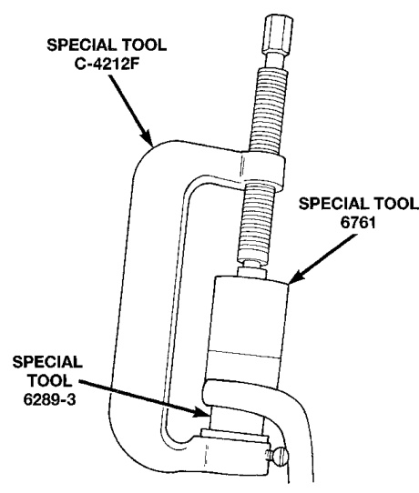
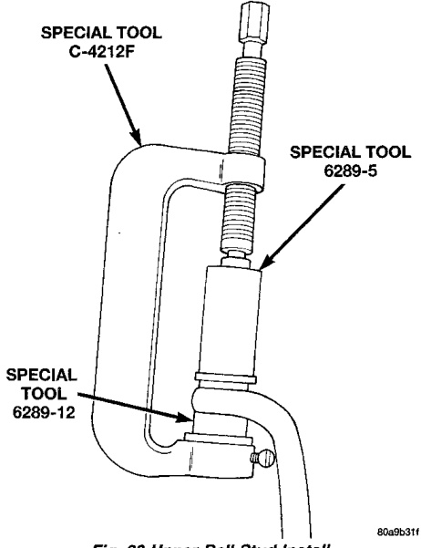
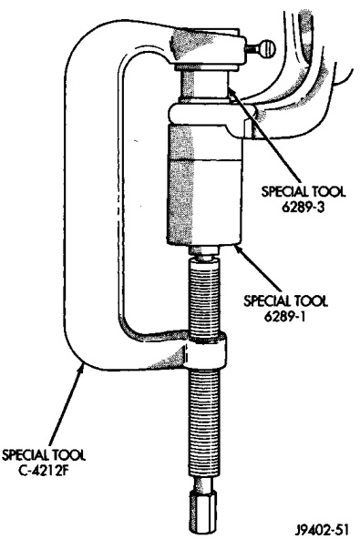

# DIFFERENTIAL AND DRIVELINE 3-30

## REMOVAL AND INSTALLATION (Continued)

#### INSTALLATION

(1) Position the steering knuckle on the ball studs.

(2) Install and tighten lower ball stud nut to 47 N·m (35 ft. lbs.) torque. Do not install cotter pin at this time.

(3) Install and tighten upper ball stud nut to 94 N·m (70 ft. lbs.) torque. Advance nut to next slot to line up hole and install new cotter pin.

(4) Retorque lower ball stud nut to 190-217 N·m (140-160 ft. lbs.) torque. Advance nut to next slot to line up hole and install new cotter pin.

(5) Install the hub bearing and axle shaft.

(6) Install tie-rod or drag link end onto the steering knuckle arm.

(7) Install the ABS sensor wire and bracket to the knuckle. Refer to Group 5, Brakes, for proper procedure.

---

### BALL STUDS—216 FBI AXLE

#### REMOVAL

(1) Position tools as shown to remove upper ball stud (Fig. 21).

*Fig. 22 Upper Ball Stud Remove*
- Special Tool C-4212F
- Special Tool 6289-3

(2) Position tools as shown to remove lower ball stud (Fig. 22).

*Fig. 23 Lower Ball Stud Remove*
- Special Tool C-4212
- Special Tool C-4212F
- Special Tool 8289-5

#### INSTALLATION

(1) Position tools as shown to install upper ball stud (Fig. 23).

*Fig. 21 Upper Ball Stud Install*
- Special Tool C-4212
- Special Tool 8289-12
- Special Tool 6762
