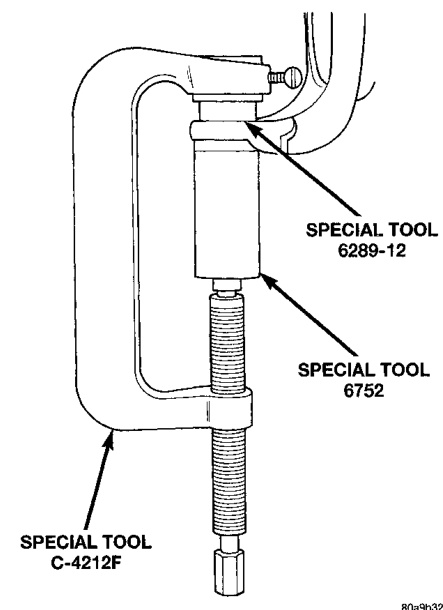
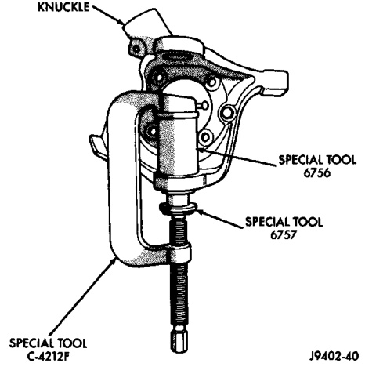
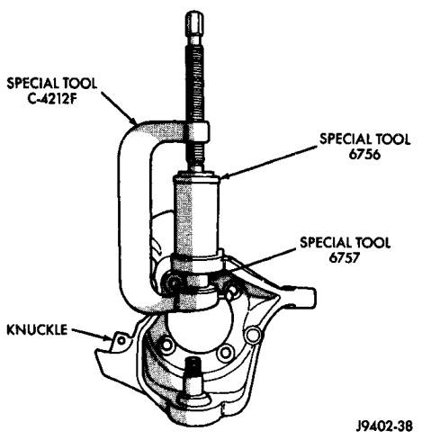

# DIFFERENTIAL AND DRIVELINE 3-31

## REMOVAL AND INSTALLATION (Continued)

(2) Position tools as shown to install lower ball stud (Fig. 24).

*Fig. 25 Lower Ball Stud Install*
- Special Tool C-4212F
- Special Tool 8289-7
- Special Tool 6762

---

### BALL STUDS—248 FBI AXLE

#### REMOVAL

(1) Position tools as shown to remove upper ball stud (Fig. 25).

*Fig. 26 Upper Ball Stud Remove*
- Special Tool C-4212
- Special Tool 6756
- Special Tool 4754
- Knuckle

(2) Position tools as shown to remove lower ball stud (Fig. 26).

*Fig. 24 Lower Ball Stud Remove*
- Special Tool C-4212F
- Special Tool 6758
- Special Tool 4756
