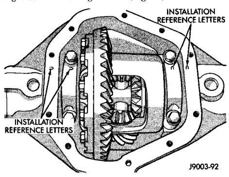
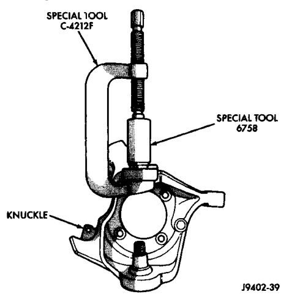
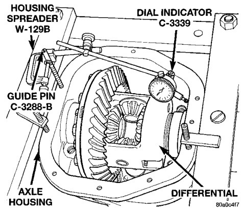
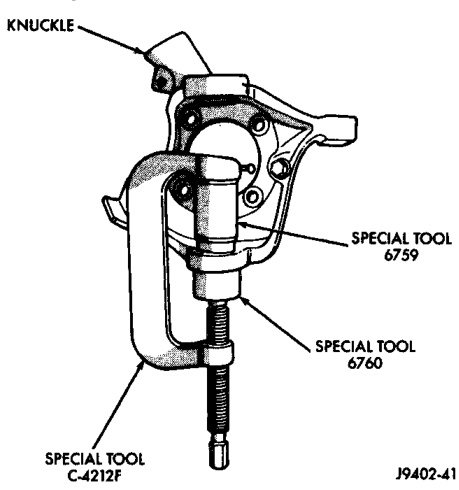

# DIFFERENTIAL AND DRIVELINE 3-32

## REMOVAL AND INSTALLATION (Continued)

#### INSTALLATION

(1) Position tools as shown to install upper ball stud (Fig. 27).

*Fig. 28 Upper Ball Stud Install*
- Special Tool C-4212
- Special Tool 8758
- Knuckle

(2) Position tools as shown to install lower ball stud (Fig. 28).

*Fig. 27 Lower Ball Stud Install*
- Special Tool C-4212F
- Special Tool 8757
- Special Tool 6762

---

### DIFFERENTIAL

#### REMOVAL

(1) Remove axle shafts.

(2) Note the orientation of the installation reference letters stamped on the bearing caps and housing machined sealing surface (Fig. 29).

*Fig. 29 Bearing Cap Identification*
- Installation Letters

(3) Remove the differential bearing caps.

(4) Position Spreader W-129-B with the tool dowel pins seated in the locating holes (Fig. 30).

(5) Install the hold down clamps and tighten the tool turnbuckle finger-tight.

*Fig. 30 Spread Differential Housing*
- Spreader
- C-3288-B
- Dial Indicator C-3339
- Axle Housing
- Differential

(6) Install a Guide Pin C-3288-B at the left side of the differential housing. Attach dial indicator to housing pilot stud. Load the indicator plunger against the opposite side of the housing (Fig. 30) and zero the indicator.

(7) Spread the housing enough to remove the case from the housing. Measure the distance with the dial indicator (Fig. 30).
