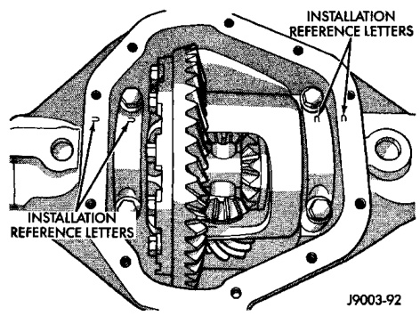
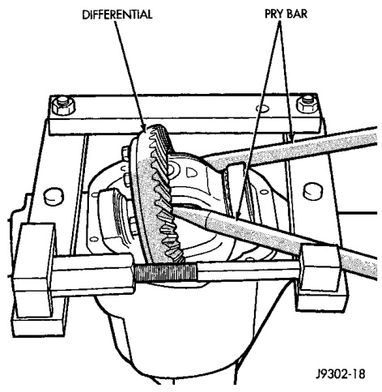
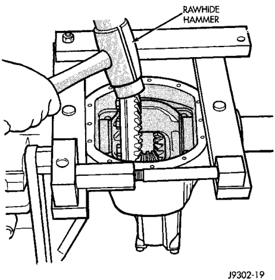

# DIFFERENTIAL AND DRIVELINE 3-33

## REMOVAL AND INSTALLATION (Continued)

> **CAUTION:** Do not spread over 0.50 mm (0.020 in). If the housing is over-spread, it could be distorted or damaged.

(8) Remove the dial indicator.

(9) Pry the differential case loose from the housing. To prevent damage, pivot on housing with the end of the pry bar against spreader (Fig. 31).

*Fig. 30 Differential Removal*
- Differential
- Prybar

(10) Remove the case from housing. Mark or tag bearing cups to indicate which side they were removed from.

#### INSTALLATION

(1) Position Spreader W-129-B with the tool dowel pins seated in the locating holes (Fig. 30). Install the hold down clamps and tighten the tool turnbuckle finger-tight.

(2) Install a Guide Pin C-3288-B at the left side of the differential housing. Attach dial indicator to housing pilot stud. Load the indicator plunger against the opposite side of the housing (Fig. 30) and zero the indicator.

(3) Spread the housing enough to install the case in the housing. Measure the distance with the dial indicator (Fig. 30).

> **CAUTION:** Do not spread over 0.50 mm (0.020 in). If the housing is over-spread, it could be distorted or damaged.

(4) Remove the dial indicator.

(5) Install differential in housing.

(6) Install case in the housing. Tap the differential case with a rawhide or rubber mallet to ensure the bearings are fully seated in the differential housing (Fig. 32).

*Fig. 31 Differential Installation*

(7) Remove the spreader.

(8) Install the bearing caps at their original locations (Fig. 33). Tighten the bearing cap bolts to 109 N·m (80 ft. lbs.) torque.

(9) Install axle shafts.

*Fig. 32 Differential Bearing Cap Reference Letters*

---

### DIFFERENTIAL SIDE BEARINGS—216 FBI AXLE

#### REMOVAL

(1) Remove differential case from axle housing.
