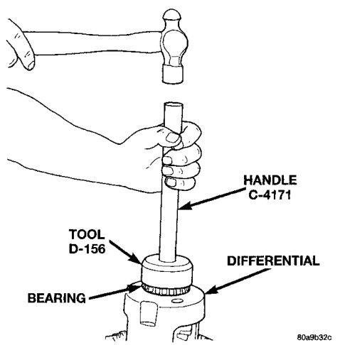
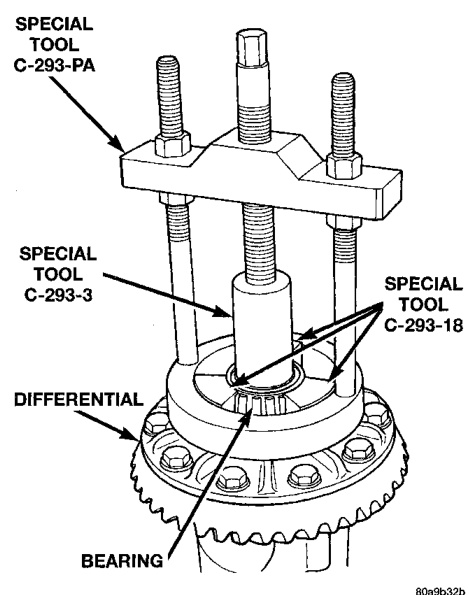
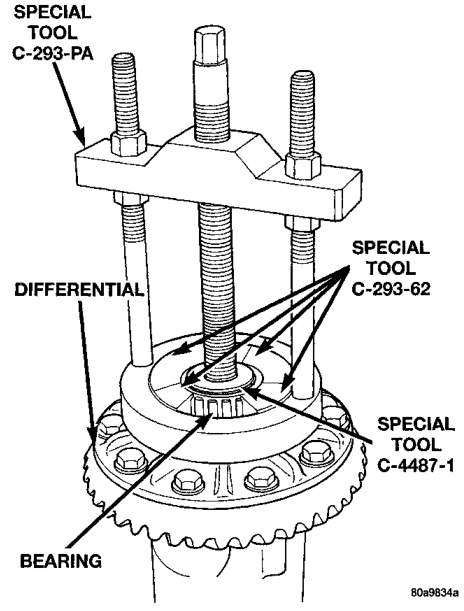

# DIFFERENTIAL AND DRIVELINE 3-34

## REMOVAL AND INSTALLATION (Continued)

(2) Remove the bearings from the differential case with Puller/Press C-293-PA, Adapters C-293-18, and Adapter C-293-3 (Fig. 34).

*Fig. 34 Differential Bearing Removal*
- Special Tool C-293-PA
- Special Tool C-293-3
- Special Tool C-293-18
- Bearing
- Differential

(3) Remove differential preload shims from differential case hubs. Tag the shims to identify which side of the differential they came from.

#### INSTALLATION

If ring and pinion gears have been replaced, verify differential side bearing preload and gear mesh backlash.

(1) Install differential preload shims on differential case hubs.

(2) Using tool D-156 with handle C-4171, install differential side bearings (Fig. 35).

*Fig. 35 Install Differential Side Bearings*
- Tool D-156
- Handle C-4171
- Bearing
- Differential

(3) Install differential in axle housing.

---

### DIFFERENTIAL SIDE BEARINGS—248 AXLES

#### REMOVAL

(1) Remove differential case from axle housing.

(2) Remove the bearings from the differential case with Puller/Press C-293-PA, Adapters C-293-62, and Step Plate C-4487-1 (Fig. 36).

*Fig. 36 Differential Bearing Removal*
- Special Tool C-293-PA
- Differential
- Special Tool C-293-62
- Special Tool C-4487-1
