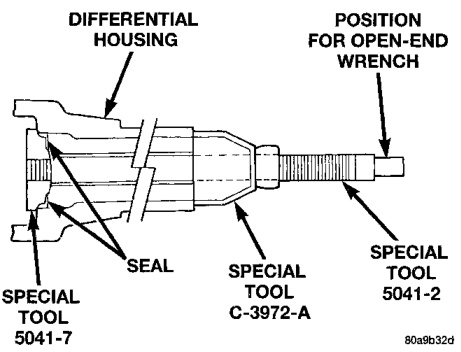
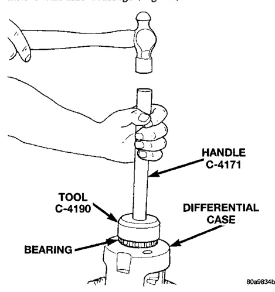
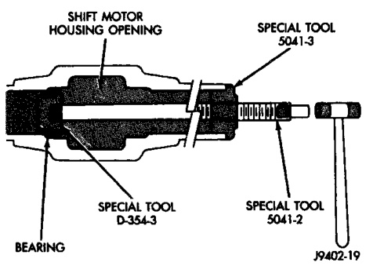
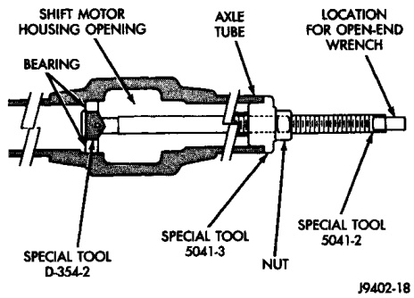

# DIFFERENTIAL AND DRIVELINE 3-35

## REMOVAL AND INSTALLATION (Continued)

#### INSTALLATION

(1) Using tool C-4190 with handle C-4171, install differential side bearings (Fig. 37).

*Fig. 37 Install Differential Side Bearings*
- Handle C-4171
- Tool C-4190
- Bearing
- Differential

(2) Install differential case in axle housing.

---

### AXLE SHAFT OIL SEAL

#### REMOVAL

(1) Remove the axle shaft seal from the differential housing with a long drift or punch. Be careful not to damage housing.

(2) Clean the inside perimeter of the differential housing with fine crocus cloth.

#### INSTALLATION

(1) Apply a light film of oil to the inside lip of the new axle shaft seal.

(2) Install the inner axle seal (Fig. 38). It may be necessary to substitute Installer C-3716-A for Installer C-3972-A on 216 FBI axles.

*Fig. 38 Axle Seal Installation*
- Opening Toward Pinion
- Special Tool 5041-7
- Shift Fork
- Axe
- Location For Open End Wrench
- Special Tool 5041-2

---

### INTERMEDIATE AXLE SHAFT

#### REMOVAL

(1) Remove the vacuum shift motor housing.

(2) Remove the outer axle shaft.

(3) Remove the inner axle shaft seal from the shift motor housing with a long drift or punch. Be careful not to damage housing.

(4) Remove intermediate axle shaft and shift collar.

(5) Remove the intermediate axle shaft bearing (Fig. 39).

*Fig. 40 Intermediate Shaft Bearing Removal*
- Special Tool 8941-2
- Special Tool 8941-1

#### INSTALLATION

(1) Position the bearing on installation tool. Seat the bearing in the housing bore (Fig. 40).

*Fig. 39 Intermediate Shaft Bearing Installation*
- Housing Opening
- Special Tool 5041-4
- Bearing
- C-4171
