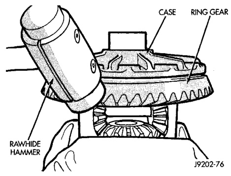
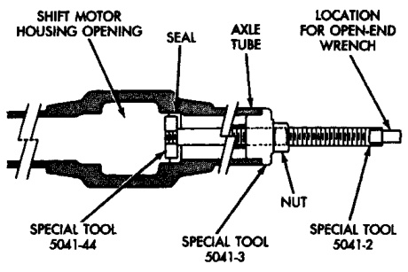
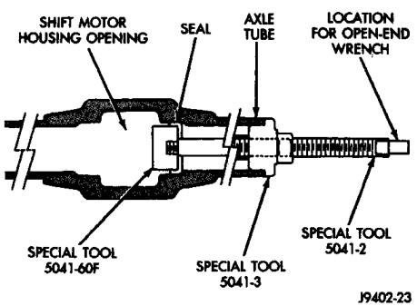

# DIFFERENTIAL AND DRIVELINE 3-36

## REMOVAL AND INSTALLATION (Continued)

(2) Clean the inside perimeter of the axle shaft tube with fine crocus cloth.

(3) Apply a light film of oil to the inside lip of the new axle shaft seal.

(4) Install the inner axle seal (Fig. 41) or (Fig. 42).

The inner axle seal position is different on a 216 FBI axle than a 248 FBI axle. Be sure to use the correct installer.

*Fig. 42 Inner Axle Seal Installation—216 FBI Axle*
- Special Tool 5041-7
- Shift Motor Housing
- Housing Opening
- Special Tool 5041-9

*Fig. 41 Inner Axle Seal Installation—248 FBI Axle*
- Special Tool 5041-7
- Shift Motor Housing
- Housing Opening
- Special Tool 5041-10

(5) Install the shift collar in the axle housing.

(6) Lubricate the splined end of the intermediate axle shaft with multi-purpose lubricant.

(7) Insert the intermediate axle shaft into the differential side gear.

> **CAUTION:** Apply all-purpose lubricant to the axle shaft splines to prevent damage to the seal during axle shaft installation.

(8) Insert the axle shaft into the tube. Engage the splined end of the shaft with the shift collar.

(9) Install the vacuum shift motor housing.

---

### RING GEAR

The ring and pinion gears are serviced in a matched set. Do not replace the ring gear without replacing the pinion gear.

#### REMOVAL

(1) Remove differential from axle housing.

(2) Place differential case in a suitable vise with soft metal jaw protectors (Fig. 43).

(3) Remove bolts holding ring gear to differential case.

(4) Using a soft hammer, drive ring gear from differential case (Fig. 43).

*Fig. 43 Ring Gear Removal*
- Case
- Ring Gear

#### INSTALLATION

> **CAUTION:** Do not reuse the bolts that held the ring gear to the differential case. The bolts can fracture causing extensive damage.

(1) Invert the differential case and start two ring gear bolts. This will provide case-to-ring gear bolt hole alignment.

(2) Install new ring gear bolts and alternately tighten to 95-122 N·m (70-90 ft. lbs.) torque for 216 FBI axles and 163-190 N·m (120-140 ft. lbs.) for 248 FBI axles (Fig. 44).

(3) Install differential in axle housing and verify gear mesh and contact pattern.

---

### PINION GEAR

**NOTE:** The ring and pinion gears are serviced in a matched set. Do not replace the pinion gear without replacing the ring gear.

#### REMOVAL

(1) Remove differential assembly from axle housing.
