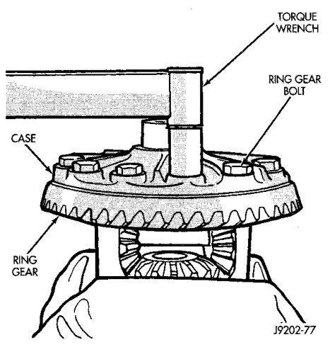
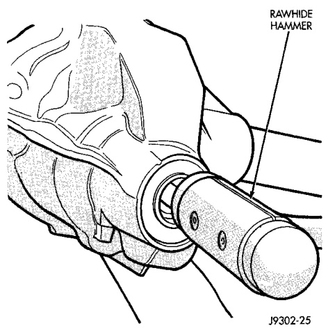
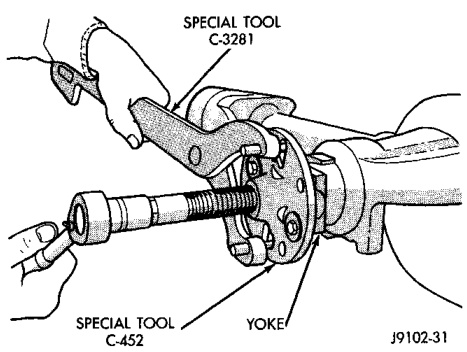
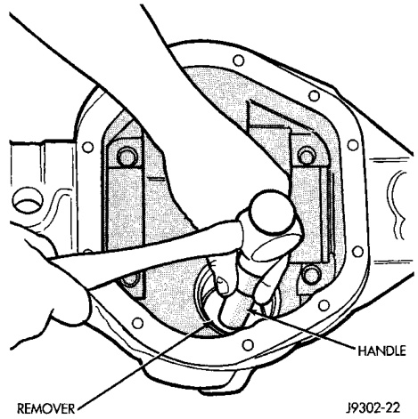

# DIFFERENTIAL AND DRIVELINE 3-37

## REMOVAL AND INSTALLATION (Continued)

*Fig. 44 Ring Gear Bolt Installation*
- Torque Wrench
- Ring Gear
- Case
- Hammer Handle

(2) Mark the pinion yoke and propeller shaft for installation alignment.

(3) Disconnect propeller shaft from pinion yoke. Using suitable wire, tie propeller shaft to underbody.

(4) Using Yoke Holder 6719 to hold yoke, remove the pinion yoke nut and washer.

(5) Using Remover C-452 and Wrench C-3281, remove the pinion yoke from the pinion shaft (Fig. 45).

*Fig. 45 Pinion Yoke Removal*
- Special Tool C-452
- Special Tool C-3281

(6) Remove the pinion gear from housing (Fig. 46). Catch the pinion with your hand to prevent it from falling and being damaged.

(7) Remove the pinion gear seal with a slide hammer or suitable pry bar.

*Fig. 46 Remove Pinion Gear*

(8) Remove oil slinger, if equipped, and the front pinion bearing.

(9) Remove the front pinion bearing cup and seal with Remover D-147 for 216 FBI axles, or D-158 for 248 FBI axles, and Handle C-4171 (Fig. 47).

*Fig. 47 Front Bearing Cup Removal*

(10) Remove the rear bearing cup from housing (Fig. 48). Use Remover D-149 for 216 FBI axles, or D-162 for 248 FBI axles, and Handle C-4171.

(11) Remove the collapsible preload spacer (Fig. 49).
