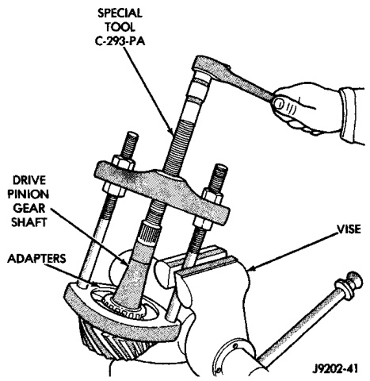
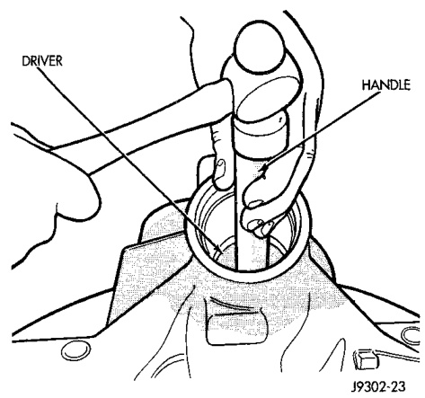
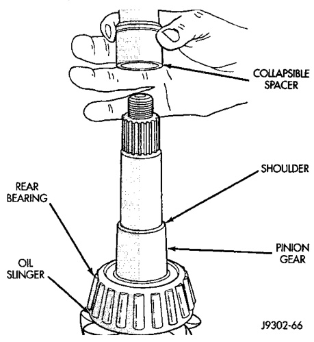
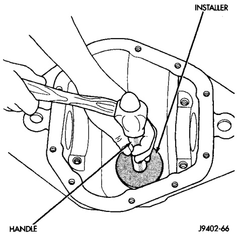

# DIFFERENTIAL AND DRIVELINE 3-38

## REMOVAL AND INSTALLATION (Continued)

*Fig. 49 Rear Bearing Cup Removal*
- Adapter
- Cup
- D-149 or D-162

*Fig. 48 Collapsible Spacer*
- Oil Slinger
- Spacer
- Seal
- Pinion
- Front Bearing

(12) Remove the rear pinion bearing from the pinion with Puller/Press C-293-PA and Adapters C-293-40 for 216 FBI axles, or C-293-37 for 248 FBI axles (Fig. 50).

Place adapter blocks so they do not damage the pinion gear teeth.

(13) Remove the depth shims from the pinion gear shaft. Record the thickness of the depth shims.

*Fig. 50 Rear Bearing Removal*
- Special Tool C-293-PA
- Special Tool C-293-40 or C-293-37
- Depth Shim
- Pinion Shaft

#### INSTALLATION

(1) Apply Mopar® Door Ease stick lubricant to outside surface of bearing cups.

(2) Install the pinion rear bearing cup with Installer D-146 for 216 FBI axles, or D-111 for 248 FBI axles, and Handle C-4171 (Fig. 51). Ensure cup is correctly seated.

*Fig. 51 Pinion Rear Bearing Cup Installation*
- Pinion
