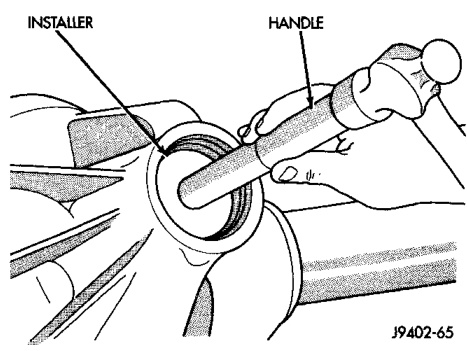
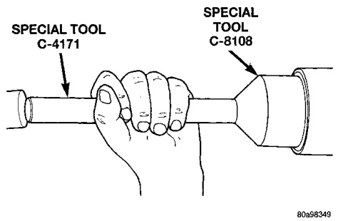
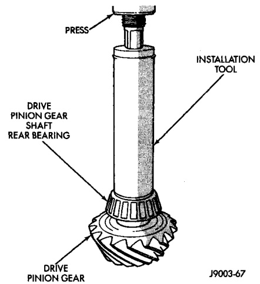

# DIFFERENTIAL AND DRIVELINE 3-39

## REMOVAL AND INSTALLATION (Continued)

(3) Install the pinion front bearing cup with Installer D-144 for 216 FBI axles, or D-146 for 248 FBI axles, and Handle C-4171 (Fig. 52).

*Fig. 52 Pinion Front Bearing Cup Installation*
- Handle C-4171
- Special Tool D-144 or D-146

(4) Install pinion front bearing, oil slinger. Apply a light coating of gear lubricant on the lip of pinion seal.

(5) Install pinion seal with Installer C-3972-A for 216 FBI axles (Fig. 53), or 8108 for 248 FBI axles (Fig. 54), and Handle C-4171.

*Fig. 53 Pinion Seal Installation—216 FBI Axle*
- Special Tool C-3972-A
- C-4171

**NOTE:** Pinion depth shims are placed between the rear pinion bearing cone and pinion gear to achieve proper ring and pinion gear mesh. If the factory installed ring and pinion gears are reused, the pinion depth shim should not require replacement. Refer to Pinion Gear Depth paragraph in this section to select the proper thickness shim before installing rear pinion bearing cone.

(6) Place the proper thickness depth shim on the pinion gear and install the rear bearing.

*Fig. 54 Pinion Seal Installation—248 FBI Axle*
- Special Tool 8108
- C-4171

(7) Install the rear bearing and oil slinger, if equipped, on the pinion gear with Installer W-262 for 216 FBI axles, or C-3095-A for 248 FBI axles (Fig. 55).

*Fig. 55 Shaft Rear Bearing Installation*
- Drive Tool
- Pinion Gear

(8) Install a new collapsible preload spacer on pinion shaft (Fig. 56).

(9) Install pinion gear in housing.

(10) Install yoke with Installer W-162-D for 216 FBI axles, or C-3718 for 248 FBI axles, and Yoke Holder 6719 (Fig. 57).

(11) Install the yoke washer and a new nut on the pinion gear. Tighten the nut to 217 N·m (160 ft. lbs.) for 216 FBI axles, or 291 N·m (215 ft. lbs.) for 248 FBI axles, minimum. Do not over-tighten. Maxi-
