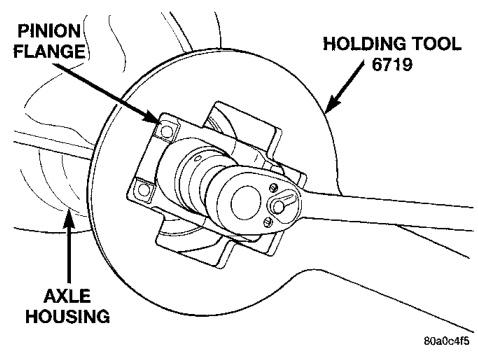
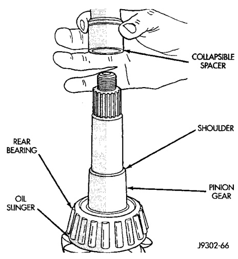
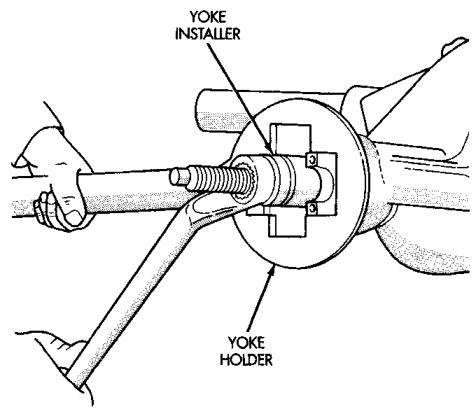
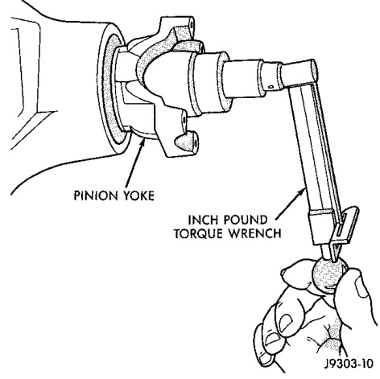

# DIFFERENTIAL AND DRIVELINE 3-40

## REMOVAL AND INSTALLATION (Continued)

*Fig. 57 Collapsible Preload Spacer*
- Pinion Flange
- Collapsible Spacer
- Oil Slinger
- Rear Bearing
- Spacer

*Fig. 56 Pinion Yoke Installation*
- Pinion Flange
- Yoke
- C-3718 or W-162-D
- Housing

mum torque is 271 N·m (200 ft. lbs.) for 216 FBI axles and 380 N·m (280 ft. lbs.) for 248 FBI axles.

> **CAUTION:** Never loosen pinion gear nut to decrease pinion gear bearing preload torque and never exceed specified preload torque. If preload torque is exceeded a new collapsible spacer must be installed. The torque sequence will have to be repeated.

(12) Use Yoke Holder 6719 to retain the yoke (Fig. 58). Tighten the nut in 6.8 N·m (5 ft. lbs.) until the rotating torque is achieved. Measure the preload torque frequently to avoid over-tightening the nut.

*Fig. 58 Tightening Pinion Nut*
- Pinion Flange
- Holding Tool 6719
- Axle Housing

(13) Check bearing preload torque with an inch pound torque wrench (Fig. 59). The torque necessary to rotate the pinion gear should be:
- Original Bearings — 1 to 3 N·m (10 to 20 in. lbs.)
- New Bearings — 2 to 5 N·m (15 to 35 in. lbs.)

*Fig. 59 Check Pinion Gear Rotation Torque*
- Inch Pound Torque Wrench
- Pinion Fork

#### FINAL ASSEMBLY

After pinion gear depth, differential bearing preload, and gear lash has been determined, install the pinion gear and differential assembly and proceed with this procedure.
