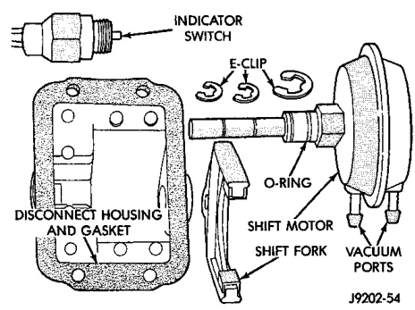
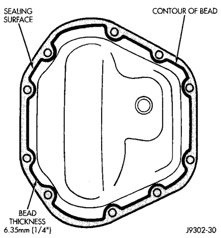
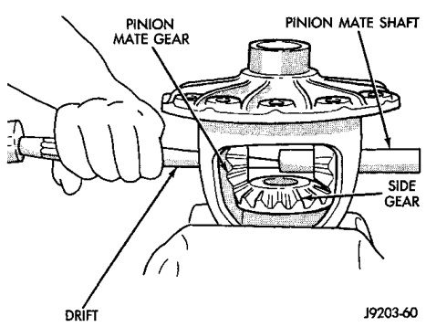

# DIFFERENTIAL AND DRIVELINE 3-41

## REMOVAL AND INSTALLATION (Continued)

(1) Install the axle shafts. Refer to Axle Shaft Installation within this group.

(2) Scrape the residual sealant from the housing and cover mating surfaces. Clean the mating surfaces with mineral spirits. Apply a bead of Mopar Silicone Rubber Sealant on the housing cover (Fig. 60). Allow the sealant to cure for a few minutes.

*Fig. 60 Typical Housing Cover With Sealant*
- Contour of Bead

Install the housing cover within 5 minutes after applying the sealant.

(3) Install the cover on the differential with the attaching bolts. Install the identification tag. Tighten the cover bolts to 41 N·m (30 ft. lbs.) torque.

> **CAUTION:** Overfilling the differential can result in lubricant foaming and overheating.

(4) Refill the differential housing with the specified quantity of Mopar Hypoid Gear Lubricant.

(5) Install the fill hole plug and tighten to 34 N·m (25 ft. lbs.) torque.

---

## DISASSEMBLY AND ASSEMBLY

### AXLE SHIFT MOTOR

#### DISASSEMBLY

(1) Remove the E-clips from the shift motor housing and shaft. Remove shift motor and shift fork from the housing (Fig. 61).

(2) Remove the O-ring seal from the shift motor shaft.

*Fig. 61 Shift Motor Components*
- E-Clip
- Disconnect Housing
- Diaphragm
- E-Clip
- Shift Fork
- Shift Motor

(3) Clean and inspect all components. If any component is excessively worn or damaged, it should be replaced.

#### ASSEMBLY

(1) Install a new O-ring seal on the shift motor shaft.

(2) Insert the shift motor shaft through the hole in the housing and shift fork. The shift fork offset should be toward the differential.

(3) Install the E-clips on the shift motor shaft and housing.

---

### STANDARD DIFFERENTIAL

#### DISASSEMBLY

(1) Remove roll-pin holding mate shaft in housing.

(2) Remove pinion gear mate shaft (Fig. 62).

(3) Rotate the differential side gears and remove the pinion mate gears and thrust washers (Fig. 63).

*Fig. 62 Pinion Mate Shaft Removal*
- Pinion Mate Shaft
- Punch
- Lockpin
