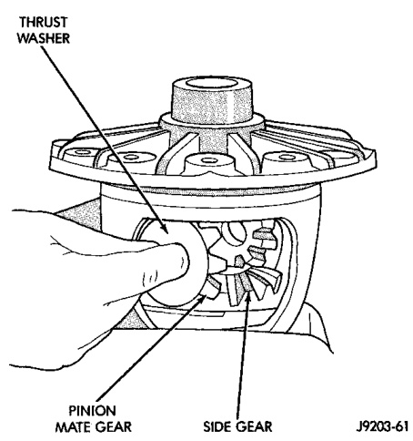
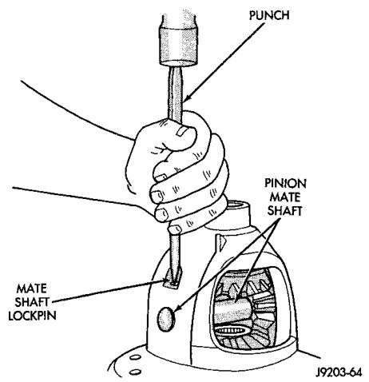

# DIFFERENTIAL AND DRIVELINE 3-42

## DISASSEMBLY AND ASSEMBLY (Continued)

*Fig. 63 Pinion Mate Gear Removal*
- Thrust Washers
- Pinion Mate Gear
- Side Gear

(4) Remove the differential side gears and thrust washers.

#### ASSEMBLY

(1) Install the differential side gears and thrust washers.

(2) Install the pinion mate gears and thrust washers.

(3) Install the pinion gear mate shaft.

(4) Align the hole in the pinion gear mate shaft with the hole in the differential case.

(5) Install and seat the pinion mate shaft roll-pin in the differential case and mate shaft with a punch and hammer (Fig. 64). Peen the edge of the roll-pin hole in the differential case slightly in two places, 180° apart.

(6) Lubricate all differential components with hypoid gear lubricant.

*Fig. 64 Pinion Mate Shaft Roll-Pin Installation*
- Punch

---

## CLEANING AND INSPECTION

### CARDAN U-JOINT

Clean all the U-joint yoke bores with cleaning solvent and a wire brush. Ensure that all the rust and foreign matter are removed from the bores.

Inspect the yokes for distortion, cracks and worn bearing cap bores.

Replace the complete U-joint if any of the components are defective.

### AXLE COMPONENTS

Wash differential components with cleaning solvent and dry with compressed air. Do not steam clean the differential components.

Wash bearings with solvent and towel dry, or dry with compressed air. DO NOT spin bearings with compressed air. Cup and bearing must be replaced as matched sets only.

Clean axle shaft tubes and oil channels in housing.

Inspect for:
- Smooth appearance with no broken/dented surfaces on the bearing rollers or the roller contact surfaces.
- Bearing cups must not be distorted or cracked.
- Machined surfaces should be smooth and without any raised edges.
- Raised metal on shoulders of cup bores should be removed with a hand stone.
- Wear and damage to pinion gear mate shaft, pinion gears, side gears and thrust washers. Replace as a matched set only.
- Ring and pinion gear for worn and chipped teeth.
- Ring gear for damaged bolt threads. Replaced as a matched set only.
- Pinion yoke for cracks, worn splines, pitted areas, and a rough/corroded seal contact surface. Repair or replace as necessary.
- Preload shims for damage and distortion. Install new shims, if necessary.

---

## ADJUSTMENTS

### PINION GEAR DEPTH

#### GENERAL INFORMATION

Ring and pinion gears are supplied as matched sets only. The identifying numbers for the ring and
