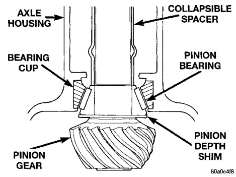
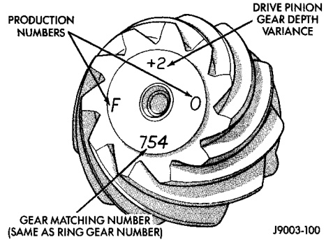

# DIFFERENTIAL AND DRIVELINE 3-43

## ADJUSTMENTS (Continued)

pinion gear are etched into the face of each gear (Fig. 65). A plus (+) number, minus (-) number or zero (0) is etched into the face of the pinion gear. This number is the amount (in thousandths of an inch) the depth varies from the standard depth setting of a pinion etched with a (0). The standard setting from the center line of the ring gear to the back face of the pinion is 109.5 mm (4.312 inches) for 216 FBI axles and 127 mm (5.00 in.) for 248 FBI axles. The standard depth provides the best teeth contact pattern. Refer to Backlash and Contact Pattern Analysis Paragraph in this section for additional information.

Compensation for pinion depth variance is achieved with select shims. The shims are placed under the inner pinion bearing cone (Fig. 66).

If a new gear set is being installed, note the depth variance etched into both the original and replacement pinion gear. Add or subtract the thickness of the original depth shims to compensate for the difference in the depth variances. Refer to the Depth Variance charts.

Note where Old and New Pinion Marking columns intersect. Intersecting figure represents plus or minus amount needed.

Note the etched number on the face of the drive pinion gear (-1, -2, 0, +1, +2, etc.). The numbers represent thousands of an inch deviation from the standard. If the number is negative, add that value to the required thickness of the depth shim(s). If the number is positive, subtract that value from the thickness of the depth shim(s). If the number is 0 no change is necessary. Refer to the Pinion Gear Depth Variance Chart.

*Fig. 66 Pinion Gear ID Numbers*
- Production Numbers
- Drive Gear Depth Variance
- Gear Matching Number (Same as Ring Gear Number)

*Fig. 65 Shim Locations*
- Axle Housing
- Collapsible Spacer
- Bearing Cup
- Pinion Bearing
- Pinion Gear
- Pinion Depth Shim

---

### PINION GEAR DEPTH VARIANCE

| Original Pinion Gear Depth Variance | Replacement Pinion Gear Depth Variance |||||||||
|-----|-------|-------|-------|-------|-------|-------|-------|-------|-------|
|     | **-4** | **-3** | **-2** | **-1** | **0** | **+1** | **+2** | **+3** | **+4** |
| **+4** | +0.008 | +0.007 | +0.006 | +0.005 | +0.004 | +0.003 | +0.002 | +0.001 | 0 |
| **+3** | +0.007 | +0.006 | +0.005 | +0.004 | +0.003 | +0.002 | +0.001 | 0 | -0.001 |
| **+2** | +0.006 | +0.005 | +0.004 | +0.003 | +0.002 | +0.001 | 0 | -0.001 | -0.002 |
| **+1** | +0.005 | +0.004 | +0.003 | +0.002 | +0.001 | 0 | -0.001 | -0.002 | -0.003 |
| **0** | +0.004 | +0.003 | +0.002 | +0.001 | 0 | -0.001 | -0.002 | -0.003 | -0.004 |
| **-1** | +0.003 | +0.002 | +0.001 | 0 | -0.001 | -0.002 | -0.003 | -0.004 | -0.005 |
| **-2** | +0.002 | +0.001 | 0 | -0.001 | -0.002 | -0.003 | -0.004 | -0.005 | -0.006 |
| **-3** | +0.001 | 0 | -0.001 | -0.002 | -0.003 | -0.004 | -0.005 | -0.006 | -0.007 |
| **-4** | 0 | -0.001 | -0.002 | -0.003 | -0.004 | -0.005 | -0.006 | -0.007 | -0.008 |

J8902-42
