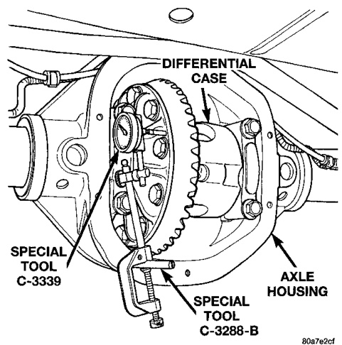
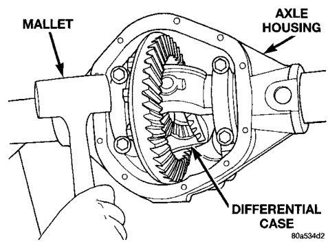
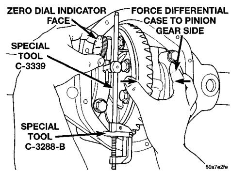
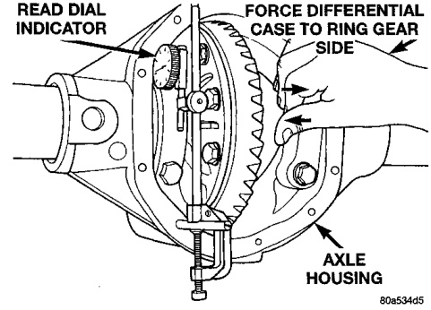
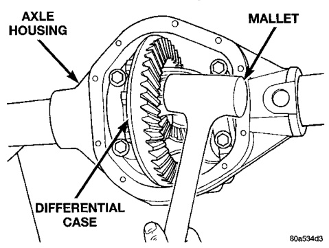

# DIFFERENTIAL AND DRIVELINE 3-46

## ADJUSTMENTS (Continued)

*Fig. 74 Seat Pinion Gear Side Differential Dummy Side Bearing*
- Mallet
- Axle Housing
- Differential Case

*Fig. 73 Seat Ring Gear Side Differential Dummy Side Bearing*
- Axle Housing
- Mallet
- Differential Case
- Special Tool C-3339
- Special Tool C-3288-B
- Axle Housing

(8) Thread guide stud C-3288-B into rear cover bolt hole below ring gear (Fig. 75).

(9) Attach a dial indicator C-3339 to guide stud. Position the dial indicator plunger on a flat surface between the ring gear bolt heads (Fig. 75).

(10) Push and hold differential case to pinion gear side of axle housing (Fig. 76).

(11) Zero dial indicator face to pointer (Fig. 76).

(12) Push and hold differential case to ring gear side of the axle housing (Fig. 77).

(13) Record dial indicator reading (Fig. 77).

(14) Add 0.015 in. (0.38 mm) to the zero end play total. This new total represents the thickness of shims to compress, or preload the new bearings when the differential is installed.

(15) Rotate dial indicator out of the way on the guide stud.

(16) Remove differential case and dummy bearings from axle housing.

*Fig. 76 Differential Side Play Measurement*
- Zero Dial Indicator Face
- Force Differential Case to Pinion Gear Side
- Special Tool C-3339
- Special Tool C-3288-B

*Fig. 77 Hold Differential Case and Zero Dial Indicator*
- Read Dial Indicator
- Force Differential Case to Ring Gear
- Special Tool C-3339
- Special Tool C-3288-B

*Fig. 75 Hold Differential Case and Read Dial Indicator*
- Axle Housing
