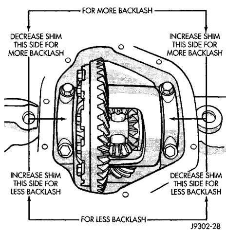

# DIFFERENTIAL AND DRIVELINE 3-48

## ADJUSTMENTS (Continued)

After the proper backlash is achieved, perform Gear Contact Pattern Analysis procedure.

*Fig. 81 Backlash Shim Adjustment*
- For More Backlash: Decrease Shim, Increase Shim (Ring Gear Side, Pinion Gear Side)
- For Less Backlash: Increase Shim, Decrease Shim (Ring Gear Side, Pinion Gear Side)

---

### GEAR CONTACT PATTERN ANALYSIS

The ring and pinion gear teeth contact patterns will show if the pinion gear depth is correct in the axle housing. It will also show if the ring gear backlash has been adjusted correctly. The backlash can be adjusted within specifications to achieve desired tooth contact patterns.

(1) Apply a thin coat of hydrated ferric oxide, or equivalent, to the drive and coast side of the ring gear teeth.

(2) Wrap, twist, and hold a shop towel around the pinion yoke to increase the turning resistance of the pinion gear. This will provide a more distinct contact pattern.

(3) Using a boxed end wrench on a ring gear bolt, Rotate the differential case one complete revolution in both directions while a load is being applied from shop towel.

The areas on the ring gear teeth with the greatest degree of contact against the pinion gear teeth will squeegee the compound to the areas with the least amount of contact. Note and compare patterns on the ring gear teeth to Gear Tooth Contact Patterns chart (Fig. 82) and adjust pinion depth and gear backlash as necessary.
