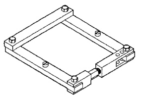
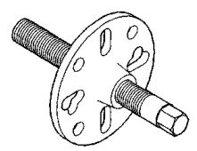
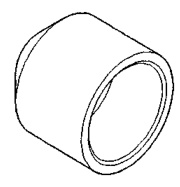
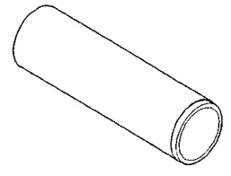
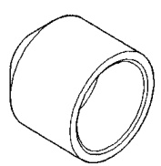
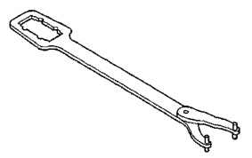

# DIFFERENTIAL AND DRIVELINE 3-51

## SPECIAL TOOLS

### 216 AND 248 FBI AXLES

*Fig. 2 Installer, Seal—C-3972-A*

*Fig. 3 Installer, Seal—8108*

*Fig. 4 Spreader, Differential—W-129-B*

*Fig. 5 Installer—C-3095-A*

*Fig. 6 Holder—C-3281*

*Fig. 7 Pilots—C-3288-B*
