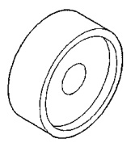
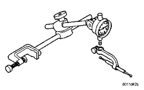
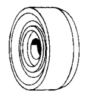
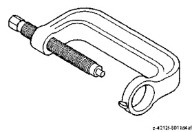
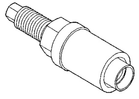
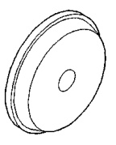
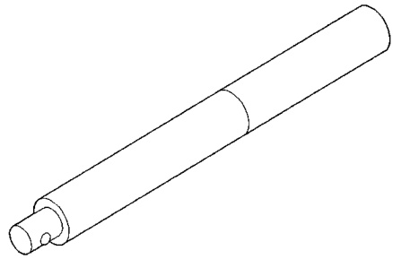
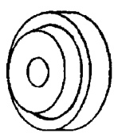

# DIFFERENTIAL AND DRIVELINE 3-52

## SPECIAL TOOLS (Continued)

*Fig. 1 Dial Indicator Set—C-3339*

*Fig. 2 Driver—C-3716-A*

*Fig. 3 Installer—C-3718*

*Fig. 4 Handle—C-4171*

*Fig. 5 Installer, Differential Bearing—C-4190*

*Fig. 6 Press, Ball Joint Remover/Installer—C-4212-F*

*Fig. 7 Installer, Pinion Bearing Cup—D-111*

*Fig. 8 Installer, Pinion Bearing Cup—D-144*
