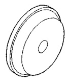
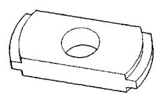
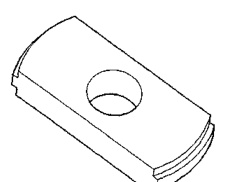
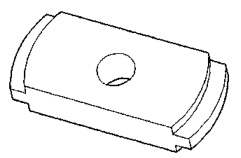
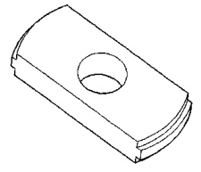
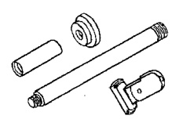
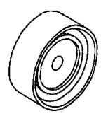

# DIFFERENTIAL AND DRIVELINE 3-53

## SPECIAL TOOLS (Continued)

*Fig. 2 Remover, Pinion Bearing Cup—D-147*

*Fig. 3 Remover, Pinion Bearing Cup—D-149*

*Fig. 4 Installer, Differential Bearing—D-156*

*Fig. 5 Remover, Pinion Bearing Cup—D-158*

*Fig. 6 Remover, Pinion Bearing Cup—D-162*

*Fig. 7 Remover/Installer Set—D-354*

*Fig. 8 Button, Bearing Puller—DD-914-42*
