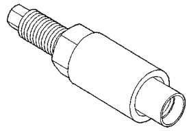
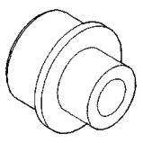
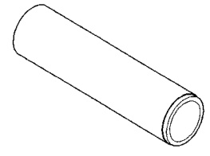
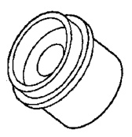
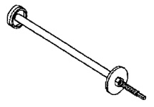
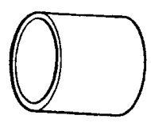
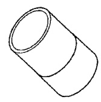
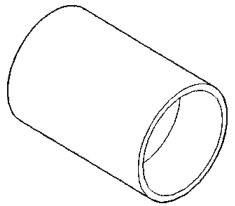

# DIFFERENTIAL AND DRIVELINE 3-54

## SPECIAL TOOLS (Continued)

*Fig. 1 Installer—W-162-D*

*Fig. 2 Installer, Pinion Bearing—W-262*

*Fig. 3 Installer Set—5041*

*Fig. 4 Receiver, Ball Stud—6289-1*

*Fig. 5 Remover, Ball Stud—6289-3*

*Fig. 6 Adapter, Ball Stud Installer—6289-12*

*Fig. 7 Installer, Ball Stud—6289-5*

*Fig. 8 Installer, Ball Stud—6752*
