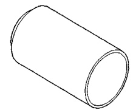
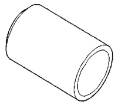
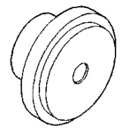
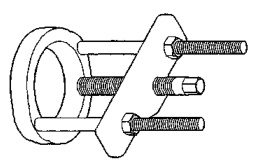
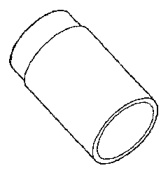
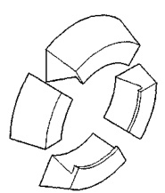
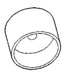
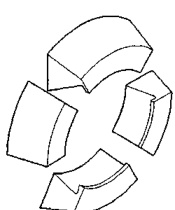
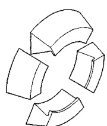

# DIFFERENTIAL AND DRIVELINE 3-55

## SPECIAL TOOLS (Continued)

*Fig. 1 Receiver, Ball Stud—6756*

*Fig. 2 Remover, Ball Stud—6757*

*Fig. 3 Receiver, Ball Stud—6759*

*Fig. 4 Installer, Ball Stud—6760*

*Fig. 5 Installer, Ball Stud—6761*

*Fig. 6 Puller/Press—C-293-PA*

*Fig. 7 Adapter, Bearing Puller—C-293-18*

*Fig. 8 Adapter, Bearing Puller—C-293-37*

*Fig. 9 Adapter, Bearing Puller—C-293-40*
