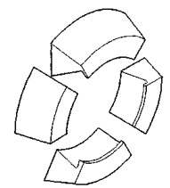
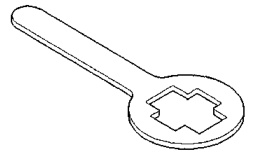
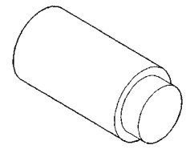
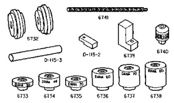
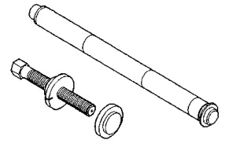

# DIFFERENTIAL AND DRIVELINE 3-56

## SPECIAL TOOLS (Continued)

*Fig. 1 Adapter, Bearing Puller—C-293-62*

*Fig. 2 Adapter—C-293-3*

*Fig. 3 Remover/Installer—C-4487*

*Fig. 4 Holder—6719*

### 6730 PINION HEIGHT SET

*Fig. 5 Set, Pinion Depth Setting—6730*
- 6741
- 6732
- D-115-2
- 6739
- 6740
- D-115-3
- 6733
- 6734
- 6735
- 6736
- 6737
- 6738
