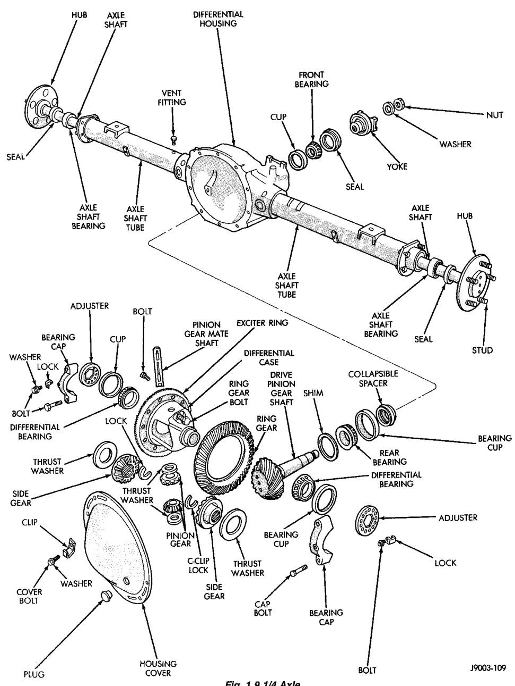

# DIFFERENTIAL AND DRIVELINE 3-58

## GENERAL INFORMATION (Continued)

*Fig. 1 9 1/4 Axle*

Component callouts:
- Hub
- Axle Shaft
- Differential Housing
- Seal
- Axle Shaft Bearing
- Axle Shaft
- Vent
- Nut
- Seal
- Axle Shaft
- Seal
- Stud
- Adjuster
- Bolt
- Pinion Gear Mate Shaft
- Exciter Ring
- Differential Case
- Collapsible Spacer
- Bearing Cap
- Differential Bearing
- Side Gear
- Bolt
- Bearing Cup
- Ring Gear
- Threaded Bushing
- Pinion Gear
- Front Bearing
- Rear Bearing
- Adjuster
- Lock
- Cover
- Bolt
- Bolt
- Housing Gasket
- Plug
- Bearing Cup
- Bearing

J9003-109
