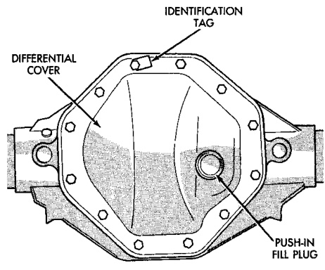

# DIFFERENTIAL AND DRIVELINE 3-59

## GENERAL INFORMATION (Continued)

### AXLE IDENTIFICATION

The axle differential cover can be used for identification of the axle (Fig. 2). An identification tag is attached to the differential cover.

- Identification Tag
- Differential Cover
- Plug/In Fill Plug

J9203-32

### LUBRICANTS

Multi-purpose, hypoid gear lubricant should be used for rear axles with a standard differential. The lubricant should have a MIL-L-2105C and API GL 5 quality specifications.

Trac-Lok differentials require the addition of 5 oz. of friction modifier to the axle lubricant after service. The 9 1/4 axle lubricant capacity is 2.32 L (4.9 pts.) total, including friction modifier, if necessary.

**NOTE:** If the rear axle is submerged in water, the lubricant must be replaced immediately. Avoid the possibility of premature axle failure resulting from water contamination of the lubricant.

---

## DESCRIPTION AND OPERATION

### STANDARD DIFFERENTIAL

The differential gear system divides the torque between the axle shafts. It allows the axle shafts to rotate at different speeds when turning corners.

Each differential side gear is splined to an axle shaft. The pinion gears are mounted on a pinion mate shaft and are free to rotate on the shaft. The pinion gear is fitted in a bore in the differential case and is positioned at a right angle to the axle shafts.

In operation, power flow occurs as follows:

- The pinion gear rotates the ring gear
- The ring gear (bolted to the differential case) rotates the case
- The differential pinion gears (mounted on the pinion mate shaft in the case) rotate the side gears
- The side gears (splined to the axle shafts) rotate the shafts

During straight-ahead driving, the differential pinion gears do not rotate on the pinion mate shaft. This occurs because input torque applied to the gears is divided and distributed equally between the two side gears. As a result, the pinion gears revolve with the pinion mate shaft but do not rotate around it (Fig. 3).

*Fig. 3 Differential Operation—Straight Ahead Driving*
- In Straight Ahead Driving Each Wheel Rotates at 100% of Case Speed
- Pinion Gear
- Side Gear
- Pinion Gears Rotate with Case

J9203-13

When turning corners, the outside wheel must travel a greater distance than the inside wheel to complete a turn. The difference must be compensated for to prevent the tires from scuffing and skidding through turns. To accomplish this, the differential allows the axle shafts to turn at unequal speeds (Fig. 4). In this instance, the input torque applied to the pinion gears is not divided equally. The pinion gears now rotate around the pinion mate shaft in opposite directions. This allows the side gear and axle shaft attached to the outside wheel to rotate at a faster speed.

### TRAC-LOK OPERATION

In a conventional differential, if one wheel spins, the opposite wheel will generate only as much torque as the spinning wheel.

In the Trac-lok differential, part of the ring gear torque is transmitted through clutch packs which contain multiple discs. The clutches will have radial grooves on the plates, and concentric grooves on the discs or bonded fiber material that is smooth in appearance.

In operation, the Trac-lok clutches are engaged by two concurrent forces. The first being the preload force exerted through Belleville spring washers
