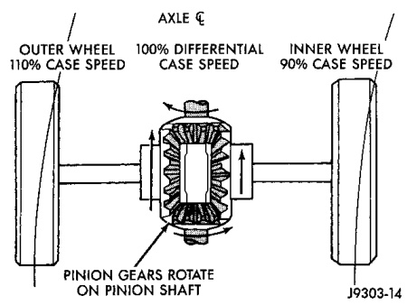
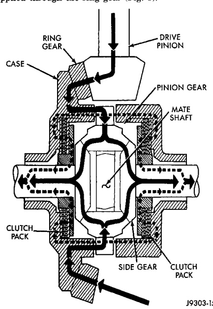

# DIFFERENTIAL AND DRIVELINE 3-60

## DESCRIPTION AND OPERATION (Continued)

*Fig. 4 Differential Operation—On Turns*
- Axle (Faster)
- 50% Differential Case Speed
- 150% Differential Case Speed
- Axle (Slower)
- Pinion Gears Rotate on Pinion Mate Shaft

within the clutch packs. The second is the separating forces generated by the side gears as torque is applied through the ring gear (Fig. 5).

*Fig. 5 Trac-lok Limited Slip Differential Operation*

The Trac-lok design provides the differential action needed for turning corners and for driving straight ahead during periods of unequal traction. When one wheel looses traction, the clutch packs transfer additional torque to the wheel having the most traction. Trac-lok differentials resist wheel spin on bumpy roads and provide more pulling power when one wheel looses traction. Pulling power is provided continuously until both wheels loose traction. If both wheels slip due to unequal traction, Trac-lok operation is normal. In extreme cases of differences of traction, the wheel with the least traction may spin.

---

## DIAGNOSIS AND TESTING

### GENERAL INFORMATION

Axle bearing problem conditions are usually caused by:
- Insufficient or incorrect lubricant.
- Foreign matter/water contamination.
- Incorrect bearing preload torque adjustment.
- Incorrect backlash.

Axle gear problem conditions are usually the result of:
- Insufficient lubrication.
- Incorrect or contaminated lubricant.
- Overloading (excessive engine torque) or exceeding vehicle weight capacity.
- Incorrect clearance or backlash adjustment.

Axle component breakage is most often the result of:
- Severe overloading.
- Insufficient lubricant.
- Incorrect lubricant.
- Improperly tightened components.

### GEAR NOISE

Axle gear noise can be caused by insufficient lubricant, incorrect backlash, tooth contact, or worn/damaged gears.

Gear noise usually happens at a specific speed range. The range is 30 to 40 mph, or above 50 mph. The noise can also occur during a specific type of driving condition. These conditions are acceleration, deceleration, coast, or constant load.

When road testing, accelerate the vehicle to the speed range where the noise is the greatest. Shift out-of-gear and coast through the peak-noise range. If the noise stops or changes greatly:
- Check for insufficient lubricant.
- Incorrect ring gear backlash.
- Gear damage.

Differential side and pinion gears can be checked by turning the vehicle. They usually do not cause noise during straight-ahead driving when the gears are unloaded. The side gears are loaded during vehicle turns. A worn pinion gear mate shaft can also cause a snapping or a knocking noise.

### BEARING NOISE

The axle shaft, differential and pinion gear bearings can all produce noise when worn or damaged.
