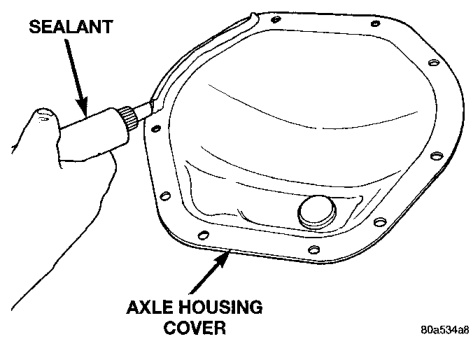
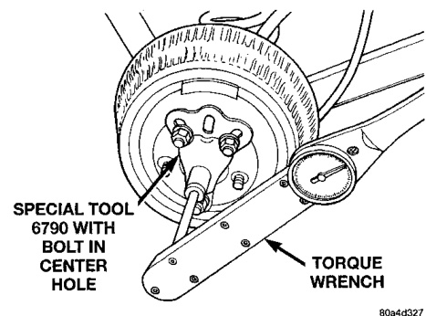

# DIFFERENTIAL AND DRIVELINE 3-64

## DIAGNOSIS AND TESTING (Continued)

### TRAC-LOK TEST

> **WARNING:** WHEN SERVICING VEHICLES WITH A TRAC-LOK DIFFERENTIAL DO NOT USE THE ENGINE TO TURN THE AXLE AND WHEELS. BOTH REAR WHEELS MUST BE RAISED AND THE VEHICLE SUPPORTED. A TRAC-LOK AXLE CAN EXERT ENOUGH FORCE IF ONE WHEEL IS IN CONTACT WITH A SURFACE TO CAUSE THE VEHICLE TO MOVE.

The differential can be tested without removing the differential case by measuring rotating torque. Make sure brakes are not dragging during this measurement.

(1) Place blocks in front and rear of both front wheels.

(2) Raise one rear wheel until it is completely off the ground.

(3) Engine off, transmission in neutral, and parking brake off.

(4) Remove wheel and bolt Special Tool 6790 to studs.

(5) Use torque wrench on special tool to rotate wheel and read rotating torque (Fig. 6).

*Fig. 6 Trac-Lok Test—Typical*
- Special Tool 6790
- Center Knob
- Torque Wrench

(6) If rotating torque is less than 22 N·m (30 ft. lbs.) or more than 271 N·m (200 ft. lbs.) on either wheel the unit should be serviced.

---

## SERVICE PROCEDURES

### LUBRICANT CHANGE

(1) Raise and support the vehicle.

(2) Remove the lubricant fill hole plug from the differential housing cover.

(3) Remove the differential housing cover and drain the lubricant from the housing.

(4) Clean the housing cavity with a flushing oil, light engine oil, or lint free cloth. Do not use water, steam, kerosene, or gasoline for cleaning.

(5) Remove the original sealant from the housing and cover surfaces.

(6) Apply a bead of Mopar® Silicone Rubber Sealant, or equivalent, to the housing cover (Fig. 7).

*Fig. 7 Apply Sealant*
- Axle Housing
- Sealant

Install the housing cover within 5 minutes after applying the sealant.

(7) Install the cover and any identification tag. Tighten the cover bolts to 41 N·m (30 ft. lbs.) torque.

(8) For Trac-lok differentials, a quantity of Mopar® Trac-lok lubricant (friction modifier), or equivalent, must be added after repair service or a lubricant change. Refer to the Lubricant Specifications section of this group for the quantity necessary.

(9) Fill differential with Mopar® Hypoid Gear Lubricant, or equivalent, to bottom of the fill plug hole. Refer to the Lubricant Specifications section of this group for the quantity necessary.

(10) Install the fill hole plug and lower the vehicle.

(11) Trac-lok differential equipped vehicles should be road tested by making 10 to 12 slow figure-eight turns. This maneuver will pump the lubricant through the clutch discs to eliminate a possible chatter noise complaint.

> **CAUTION:** Overfilling the differential can result in lubricant foaming and overheating.

---

## REMOVAL AND INSTALLATION

### REAR AXLE

#### REMOVAL

(1) Raise and support the vehicle.
