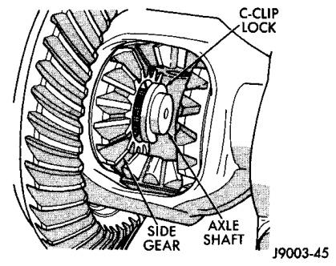
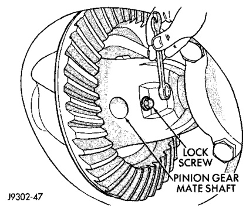

# DIFFERENTIAL AND DRIVELINE 3-65

## REMOVAL AND INSTALLATION (Continued)

(2) Position a suitable lifting device under the axle.

(3) Secure axle to device.

(4) Remove the wheels and tires.

(5) Secure brake drums to the axle shaft.

(6) Remove the RWAL sensor from the differential housing, if necessary. Refer to Group 5, Brakes, for proper procedures.

(7) Disconnect the brake hose at the axle junction block. Do not disconnect the brake hydraulic lines at the wheel cylinders. Refer to Group 5, Brakes, for proper procedures.

(8) Disconnect the parking brake cables and cable brackets.

(9) Disconnect the vent hose from the axle shaft tube.

(10) Mark the propeller shaft and yoke for installation alignment reference.

(11) Remove propeller shaft.

(12) Disconnect shock absorbers from axle.

(13) Remove the spring clamps and spring brackets. Refer to Group 2, Suspension, for proper procedures.

(14) Separate the axle from the vehicle.

#### INSTALLATION

(1) Raise the axle with lifting device and align to the leaf spring centering bolts.

(2) Install the spring clamps and spring brackets. Refer to Group 2, Suspension, for proper procedures.

(3) Install shock absorbers and tighten nuts to 82 N·m (60 ft. lbs.) torque.

(4) Install the RWAL sensor to the differential housing, if necessary. Refer to Group 5, Brakes, for proper procedures.

(5) Connect the parking brake cables and cable brackets.

(6) Install the brake drums. Refer to Group 5, Brakes, for proper procedures.

(7) Connect the brake hose to the axle junction block. Refer to Group 5, Brakes, for proper procedures.

(8) Install axle vent hose.

(9) Align propeller shaft and pinion yoke reference marks. Install universal joint straps and bolts. Tighten to 19 N·m (14 ft. lbs.) torque.

(10) Install the wheels and tires.

(11) Add gear lubricant, if necessary. Refer to Lubricant Specifications in this section for lubricant requirements.

(12) Remove lifting device from axle and lower the vehicle.

---

### AXLE SHAFT

#### REMOVAL

(1) Raise and support vehicle. Ensure that the transmission is in neutral.

(2) Remove wheel and tire assembly.

(3) Remove brake drum. Refer to Group 5, Brakes, for proper procedure.

(4) Clean all foreign material from housing cover area.

(5) Loosen housing cover bolts. Drain lubricant from the housing and axle shaft tubes. Remove housing cover.

(6) Rotate differential case so that pinion mate gear shaft lock screw is accessible. Remove lock screw and pinion mate gear shaft from differential case (Fig. 8).

*Fig. 9 Mate Shaft Lock Screw*
- Gear Shaft
- Lock Screw

(7) Push axle shaft inward and remove axle shaft C-clip lock from the axle shaft (Fig. 9).

*Fig. 8 Axle Shaft C-Clip Lock*
- C-Clip
