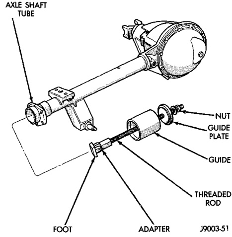
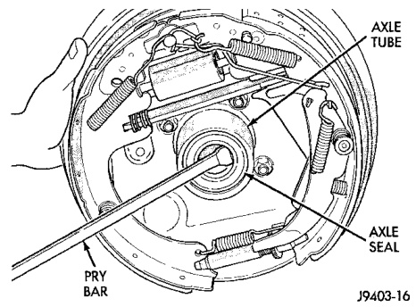

# DIFFERENTIAL AND DRIVELINE 3-66

## REMOVAL AND INSTALLATION (Continued)

(8) Remove axle shaft. Use care to prevent damage to axle shaft bearing and seal, which will remain in axle shaft tube.

(9) Inspect axle shaft seal for leakage or damage.

(10) Inspect roller bearing contact surface on axle shaft for signs of brinelling, galling and pitting. If any of these conditions exist, the axle shaft and/or bearing and seal must be replaced.

#### INSTALLATION

(1) Lubricate bearing bore and seal lip with gear lubricant. Insert axle shaft through seal, bearing, and engage it into side gear splines.

**NOTE:** Use care to prevent axle shaft splines from damaging axle shaft seal.

(2) Insert C-clip lock in end of axle shaft. Push axle shaft outward to seat C-clip lock in side gear.

(3) Insert pinion mate shaft into differential case and through thrust washers and pinion gears.

(4) Align hole in shaft with hole in the differential case and install lock screw with Loctite® on the threads. Tighten lock screw to 11 N·m (8 ft. lbs.) torque.

(5) Install cover and add fluid. Refer to Lubricant Change procedure in this section for procedure and lubricant requirements.

(6) Install brake drum. Refer to Group 5, Brakes, for proper procedures.

(7) Install wheel and tire.

(8) Lower vehicle.

---

### 9 1/4 LD AXLE SEAL AND BEARING

#### REMOVAL

(1) Remove axle shaft.

(2) Remove axle shaft seal from the end of the axle tube with a small pry bar (Fig. 10).

**NOTE:** The seal and bearing can be removed at the same time with the bearing removal tool.

(3) Remove the axle shaft bearing from the axle tube with Bearing Removal Tool Set 6310, using Adapter Foot 6310-9 (Fig. 11).

*Fig. 11 Axle Seal Removal*

*Fig. 10 Axle Shaft Bearing Removal Tool*

#### INSTALLATION

**NOTE:** Do not install the original axle shaft seal. Always install a new seal.

(1) Wipe the axle tube bore clean. Remove any old sealer or burrs from the tube.

(2) Install the axle shaft bearing with Installer C-4198 and Handle C-4171 (Fig. 12). Ensure that the bearing part number is against the installer. Verify that the bearing is installed straight and the tool fully contacts the axle tube when seating the bearing.

(3) Install a new axle seal with Installer C-4076-B and Handle C-4735-1. When the tool contacts the axle tube, the seal is installed to the correct depth.

(4) Coat the lip of the seal with axle lubricant for protection prior to installing the axle shaft.

(5) Install the axle shaft.

---

### 9 1/4 HD AXLE SEAL AND BEARING

#### REMOVAL

(1) Remove axle shaft.

(2) Remove axle shaft seal from the end of the axle tube with a small pry bar (Fig. 13).
