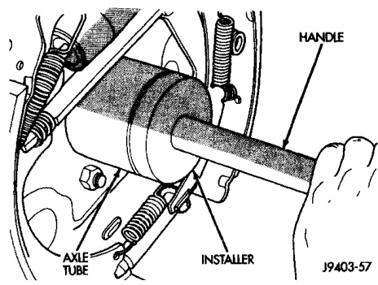
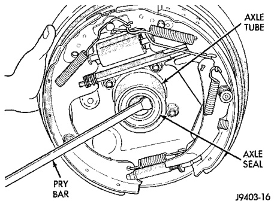
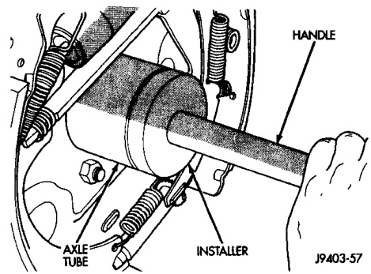
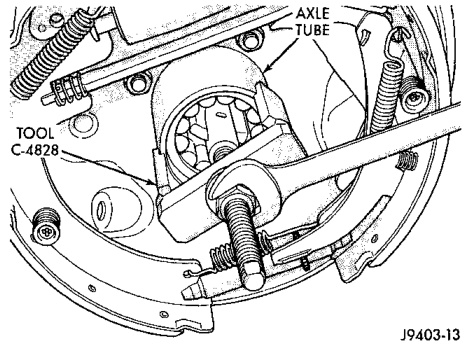

# DIFFERENTIAL AND DRIVELINE 3-67

## REMOVAL AND INSTALLATION (Continued)

*Fig. 13 Axle Shaft Seal and Bearing Installation*
- Handle
- Axle
- Installer

J9403-57

(3) Remove the axle shaft bearing from the axle tube with Bearing Removal Tool C-4828 (Fig. 14).

*Fig. 14 Axle Seal Removal*
- Axle Tube
- Axle Seal
- Pry Bar
- Axle Tube

J9403-16

*Fig. 12 Axle Shaft Bearing Removal Tool*
- Tool C-4828

J9403-15

#### INSTALLATION

**NOTE:** Do not install the original axle shaft seal. Always install a new seal.

(1) Wipe the axle tube bore clean. Remove any old sealer or burrs from the tube.

(2) Install the axle shaft bearing with Installer C-4826-1 and Handle C-4171 (Fig. 15). Ensure that the bearing part number is against the installer. Verify that the bearing is installed straight and the tool fully contacts the axle tube when seating the bearing.

(3) Install a new axle seal with Installer C-4826-1, Adapter C-4826-2, and Handle C-4171. When the tool contacts the axle tube, the seal is installed to the correct depth.

(4) Coat the lip of the seal with axle lubricant for protection prior to installing the axle shaft.

(5) Install the axle shaft.

*Fig. 15 Axle Shaft Seal and Bearing Installation*
- Handle
- Axle Tube
- Axle
- Installer

J9403-57

---

### PINION SEAL

#### REMOVAL

(1) Raise and support the vehicle.

(2) Scribe a mark on the universal joint, pinion yoke, and pinion shaft for reference.

(3) Disconnect the propeller shaft from the pinion yoke. Secure the propeller shaft in an upright position to prevent damage to the rear universal joint.

(4) Remove the wheel and tire assemblies.

(5) Remove the brake drums to prevent any drag. The drag may cause a false bearing preload torque measurement.

(6) Rotate the pinion yoke three or four times.

(7) Measure the amount of torque necessary to rotate the pinion gear with a (in. lbs.) dial-type torque wrench. Record the torque reading for installation reference.

(8) Hold the yoke with Wrench 6719. Remove the pinion shaft nut and washer.
