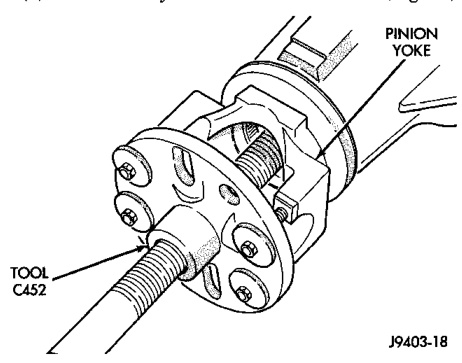
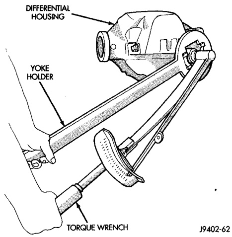
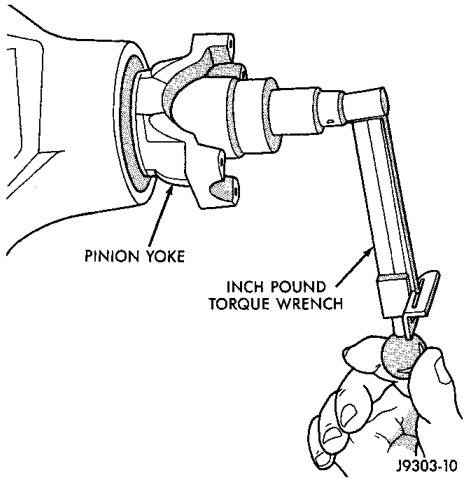

# DIFFERENTIAL AND DRIVELINE 3-68

## REMOVAL AND INSTALLATION (Continued)

(9) Remove the yoke with Remover C-452 (Fig. 16).

*Fig. 16 Yoke Removal*
- Yoke
- C-452

J9403-14

(10) Remove the pinion shaft seal with suitable pry tool or slide-hammer mounted screw.

#### INSTALLATION

(1) Clean the seal contact surface in the housing bore.

(2) Examine the splines on the pinion shaft for burrs or wear. Remove any burrs and clean the shaft.

(3) Inspect pinion yoke for cracks, worn splines and worn seal contact surface. Replace yoke if necessary.

**NOTE:** The outer perimeter of the seal is pre-coated with a special sealant. An additional application of sealant is not required.

(4) Apply a light coating of gear lubricant on the lip of pinion seal.

(5) Install the new pinion shaft seal with Installer C-3860-A and Handle C-4171.

**NOTE:** The seal is correctly installed when the seal flange contacts the face of the differential housing flange.

(6) Position the pinion yoke on the end of the shaft with the reference marks aligned.

(7) Seat yoke on pinion shaft with Installer C-3718 and Wrench 6719.

(8) Remove the tools and install the pinion yoke washer. The convex side of the washer must face outward.

> **CAUTION:** Do not exceed the minimum tightening torque when installing the pinion yoke retaining nut at this point. Damage to collapsible spacer or bearings may result.

(9) Hold pinion yoke with Yoke Holder 6719 and tighten shaft nut to 285 N·m (210 ft. lbs.) (Fig. 17). Rotate pinion shaft several revolutions to ensure the bearing rollers are seated.

*Fig. 17 Tightening Pinion Shaft Nut*
- Torque Wrench
- Holder 6719

(10) Rotate the pinion shaft using an (in. lbs.) torque wrench. Rotating torque should be equal to the reading recorded during removal, plus an additional 0.56 N·m (5 in. lbs.) (Fig. 18).

*Fig. 18 Check Pinion Rotation Torque*
- Pinion Fork
- Torque Wrench
- Inch Pound

J9003-10
