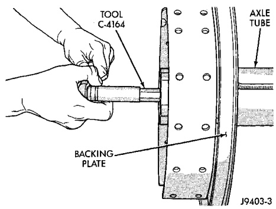
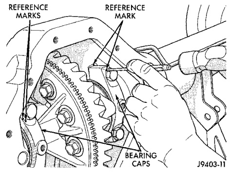
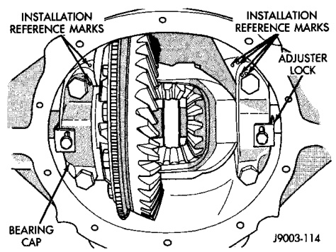

# DIFFERENTIAL AND DRIVELINE 3-69

## REMOVAL AND INSTALLATION (Continued)

> **CAUTION:** Never loosen pinion gear nut to decrease pinion gear bearing rotating torque and never exceed specified preload torque. If rotating torque is exceeded a new collapsible spacer must be installed. The torque sequence will then have to be repeated.

(11) If the rotating torque is low, use Yoke Holder 6719 to hold the pinion yoke (Fig. 17) and tighten the pinion shaft nut in 6.8 N·m (5 ft. lbs.) increments until proper rotating torque is achieved.

**NOTE:** The bearing rotating torque should be constant during a complete revolution of the pinion. If the rotating torque varies, this indicates a binding condition.

(12) The seal replacement is unacceptable if the final pinion nut torque is less than 285 N·m (210 ft. lbs.).

(13) Install the propeller shaft with the installation reference marks aligned.

(14) Tighten the universal joint yoke clamp screws to 19 N·m (14 ft. lbs.).

(15) Install the brake drums.

(16) Install wheel and tire assemblies and lower the vehicle.

(17) Check the differential housing lubricant level.

---

### DIFFERENTIAL

#### REMOVAL

(1) Remove the axle shafts.

(2) Remove RWAL/ABS sensor from housing.

**NOTE:** Side play resulting from bearing races being loose on case hubs requires replacement of the differential case.

(3) Mark the differential housing and the differential bearing caps for installation reference (Fig. 19).

*Fig. 17 Mark For Installation Reference*
- Reference Marks
- Installation Reference Marks
- Bearing Caps

J9403-11

(4) Remove bearing threaded adjuster lock from each bearing cap. Loosen the bolts, but do not remove the bearing caps.

(5) Loosen the threaded adjusters with Wrench C-4164 (Fig. 20).

*Fig. 19 Threaded Adjuster Tool*
- Tool C-4164
- Axle
- Differential
- Backing Plate

J9403-3

(6) Hold the differential case while removing bearing caps and adjusters.

(7) Remove the differential case.

**NOTE:** Each differential bearing cup and threaded adjuster must be kept with their respective bearing.

#### INSTALLATION

(1) Apply a coating of hypoid gear lubricant to the differential bearings, bearing cups, and threaded adjusters. A dab of grease can be used to keep the adjusters in position. Carefully position the assembled differential case in the housing.

(2) Observe the reference marks and install the differential bearing caps at their original locations (Fig. 21).

*Fig. 20 Bearing Caps & Bolts*
- Installation Reference Marks
- Adjuster Lock
- Bearing Cap

J9003-114
