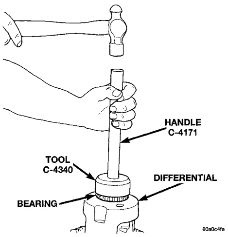
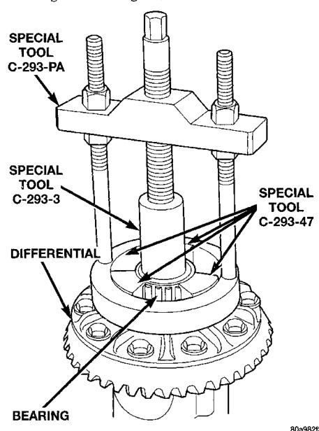
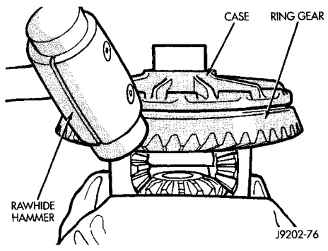

# DIFFERENTIAL AND DRIVELINE 3-70

## REMOVAL AND INSTALLATION (Continued)

(3) Install bearing cap bolts and tighten the upper bolts to 14 N·m (10 ft. lbs.). Tighten the lower bolts finger-tight until the bolt head is seated.

(4) Perform the differential bearing preload and adjustment procedure.

(5) Install axle shafts and differential housing cover.

---

### DIFFERENTIAL SIDE BEARINGS

#### REMOVAL

(1) Remove differential case from axle housing.

(2) Remove the bearings from the differential case with Puller/Press C-293-PA and Adapters C-293-47 and Plug C-293-3 (Fig. 22).

*Fig. 22 Differential Bearing Removal*
- Tool C-4340
- Handle C-4171
- Tool C-293-3
- Special Tool C-293-47
- Differential
- Bearing

#### INSTALLATION

(1) Install differential side bearings. Use Installer C-4213 and Handle C-4171 (Fig. 23).

(2) Install differential case in axle housing.

*Fig. 23 Install Differential Side Bearings*
- Tool C-4213
- Differential

---

### RING GEAR AND EXCITER RING

**NOTE:** The ring and pinion gears are serviced in a matched set. Do not replace the ring gear without replacing the pinion gear.

#### REMOVAL

(1) Remove differential from axle housing.

(2) Place differential case in a suitable vise with soft metal jaw protectors (Fig. 24).

(3) Remove bolts holding ring gear to differential case.

(4) Using a soft hammer, drive ring gear from differential case (Fig. 24).

*Fig. 24 Ring Gear Removal*
- Case
- Ring Gear

J9002-16

(5) Use a brass drift and slowly tap the exciter ring from the differential case.

#### INSTALLATION

> **CAUTION:** Do not reuse the bolts that held the ring gear to the differential case. The bolts can fracture causing extensive damage.
