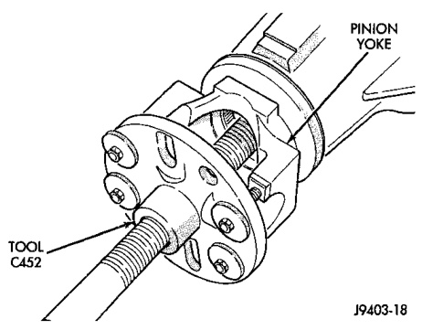
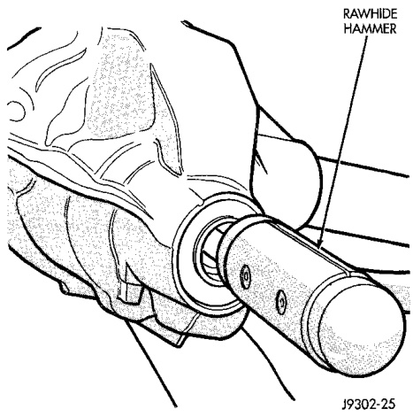
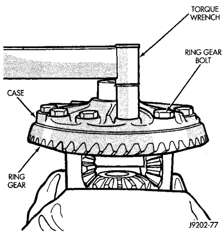

# DIFFERENTIAL AND DRIVELINE 3-71

## REMOVAL AND INSTALLATION (Continued)

(1) Invert the differential case.

(2) Position exciter ring on differential case.

(3) Using a brass drift, slowly and evenly tap the exciter ring into position.

(4) Position ring gear on the differential case and start two ring gear bolts. This will provide case-to-ring gear bolt hole alignment.

(5) Invert the differential case in the vise.

(6) Install new ring gear bolts and alternately tighten to 157 N·m (115 ft. lbs.) torque (Fig. 25).

(7) Install differential in axle housing and verify gear mesh and contact pattern.

*Fig. 25 Ring Gear Bolt Installation*
- Torque Wrench

J9002-77

---

### PINION GEAR

**NOTE:** The ring and pinion gears are serviced in a matched set. Do not replace the pinion gear without replacing the ring gear.

#### REMOVAL

(1) Remove differential from the axle housing.

(2) Mark pinion yoke and propeller shaft for installation alignment.

(3) Disconnect propeller shaft from pinion yoke. Using suitable wire, tie propeller shaft to underbody.

(4) Using Yoke Holder 6719 to hold yoke and remove the pinion yoke nut and washer.

(5) Using Remover C-452, remove the pinion yoke from pinion shaft (Fig. 26).

(6) Partially install pinion nut onto pinion to protect the threads.

*Fig. 27 Pinion Yoke Removal*

J9403-18

(7) Remove the pinion gear from housing (Fig. 27). Catch the pinion with your hand to prevent it from falling and being damaged.

*Fig. 26 Remove Pinion Gear*
- Hammer Handle

J9103-23

(8) Remove the pinion shaft seal with suitable pry tool or slide-hammer mounted screw.

(9) Remove oil slinger, if equipped, and front pinion bearing.

(10) Remove the front pinion bearing cup with Bearing Removal Tool Set 6310 and Adapter Foot 6310-9.

(11) Remove the rear bearing cup from housing (Fig. 28). Use Remover C-4309 and Handle C-4171 for the 9 1/4 axle.

(12) Remove the collapsible preload spacer (Fig. 29).
