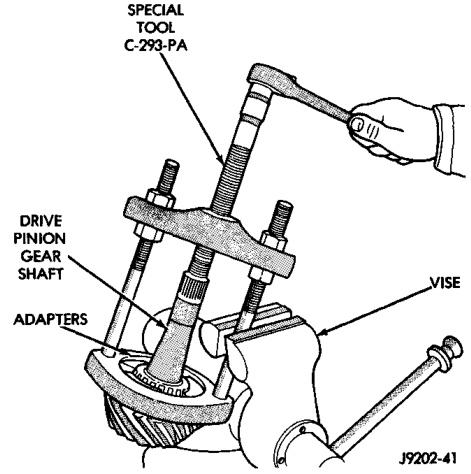
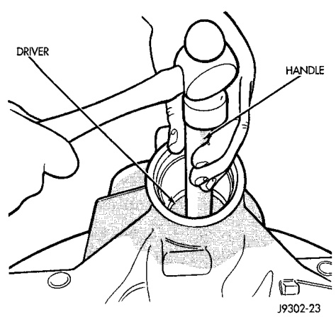
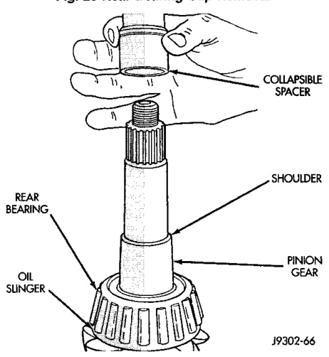
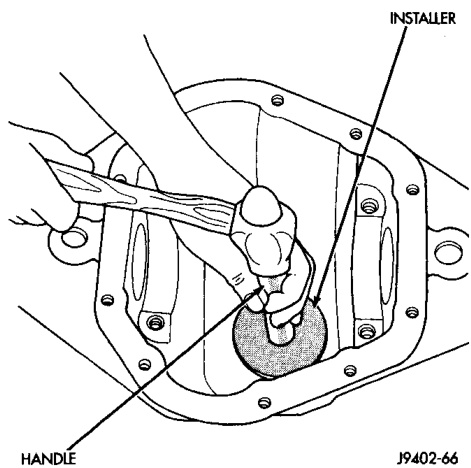

# DIFFERENTIAL AND DRIVELINE 3-72

## REMOVAL AND INSTALLATION (Continued)

*Fig. 29 Rear Bearing Cup Removal*
- Driver
- Handle
- C-4309

W9401-22

*Fig. 28 Collapsible Spacer*
- Oil Slinger
- Rear Bearing
- Spacer
- Shoulder
- Seal
- Front Bearing

J9403-46

(13) Remove the rear bearing from the pinion (Fig. 30) with Puller/Press C-293-PA and Adapters C-293-37.

Place adapter blocks so they do not damage the bearing cups.

(14) Remove the depth shims from the pinion gear shaft. Record the thickness of the depth shims.

#### INSTALLATION

(1) Apply Mopar® Door Ease, or equivalent, stick lubricant to outside surface of bearing cup.

*Fig. 30 Rear Bearing Removal*
- Special Tool C-293-PA
- Adapter
- Drive Pinion Gear Rear Bearing

J9003-47

(2) Install the pinion rear bearing cup (Fig. 31) with Installer C-4310 and Driver Handle C-4171.

(3) Ensure cup is correctly seated.

*Fig. 31 Pinion Rear Bearing Cup Installation*
- Handle
- Installer

J9003-41

(4) Apply Mopar® Door Ease, or equivalent, stick lubricant to outside surface of bearing cup.

(5) Install the pinion front bearing cup (Fig. 32) with Installer D-129 and Handle C-4171.

(6) Install pinion front bearing, and oil slinger, if equipped.
