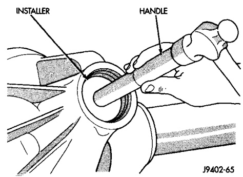
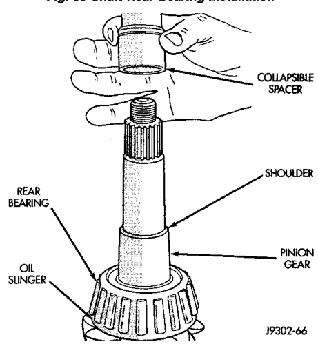
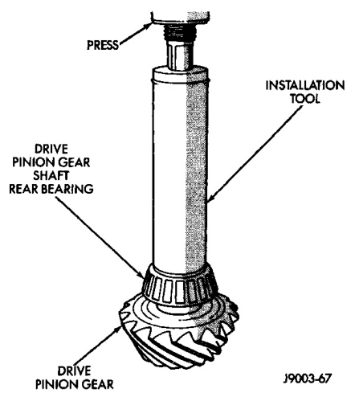

# DIFFERENTIAL AND DRIVELINE 3-73

## REMOVAL AND INSTALLATION (Continued)

*Fig. 32 Pinion Front Bearing Cup Installation*
- Handle
- Installer

(7) Apply a light coating of gear lubricant on the lip of pinion seal.

(8) Install seal with Installer C-3860-A and Handle C-4171.

**NOTE:** Pinion depth shims are placed between the rear pinion bearing cone and pinion gear to achieve proper ring and pinion gear mesh. If the factory installed ring and pinion gears are reused, the pinion depth shim should not require replacement. If required, refer to Pinion Gear Depth to select the proper thickness shim before installing rear pinion bearing.

(9) Place the proper thickness depth shim on the pinion gear.

(10) Install the rear bearing and slinger, if equipped, on the pinion gear (Fig. 33) with Installer C-3095.

(11) Install a new collapsible preload spacer on pinion shaft and install pinion gear in housing (Fig. 34).

(12) Install pinion gear in housing.

(13) Install yoke with Installer C-3718 and Yoke Holder 6719.

(14) Install the yoke washer and a new nut on the pinion gear and tighten the pinion nut until there is zero bearing end-play. It will not be possible at this point to achieve zero bearing end-play if a new collapsible spacer was installed.

(15) Tighten the nut to 285 N·m (210 ft. lbs.).

> **CAUTION:** Never loosen pinion gear nut to decrease pinion gear bearing rotating torque and never exceed specified preload torque. If preload torque or rotating torque is exceeded a new collapsible spacer must be installed. The torque sequence will then have to be repeated.

*Fig. 34 Shaft Rear Bearing Installation*
- Free

*Fig. 33 Collapsible Preload Spacer*

(16) Using Yoke Holder 6719, crush collapsible spacer until bearing end play is taken up.

(17) Slowly tighten the nut in 6.8 N·m (5 ft. lbs.) increments until the desired rotating torque is achieved. Measure the rotating torque frequently to avoid over crushing the collapsible spacer (Fig. 35).

(18) Check bearing rotating torque with an inch pound torque wrench (Fig. 35). The torque necessary to rotate the pinion gear should be:
