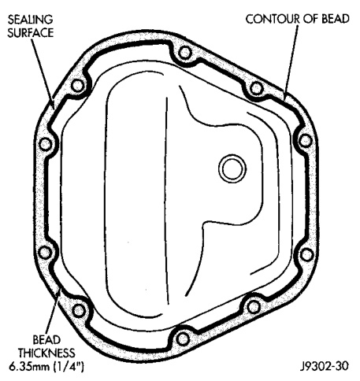
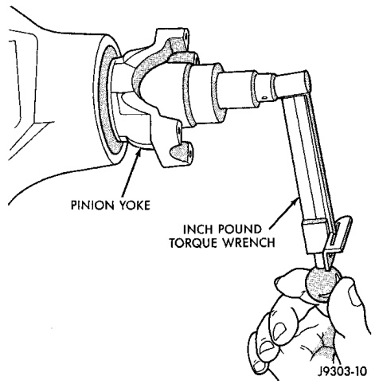
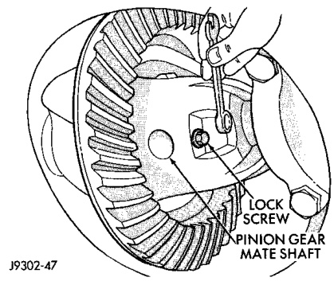

# DIFFERENTIAL AND DRIVELINE 3-74

## REMOVAL AND INSTALLATION (Continued)

- Original Bearings — 1 to 3 N·m (10 to 20 in. lbs.)
- New Bearings — 2 to 5 N·m (15 to 35 in. lbs.)

*Fig. 35 Check Pinion Gear Rotating Torque*
- Pinion Fork
- Inch Pound Torque Wrench

J9003-30

(19) Install propeller shaft.

(20) Install differential in housing.

---

### FINAL ASSEMBLY

(1) Scrape the residual sealant from the housing and cover mating surfaces. Clean the mating surfaces with mineral spirits. Apply a bead of Mopar® Silicone Rubber Sealant, or equivalent, on the housing cover (Fig. 36).

Install the housing cover within 5 minutes after applying the sealant.

(2) Install the cover on the differential with the attaching bolts. Install the identification tag. Tighten the cover bolts to 41 N·m (30 ft. lbs.) torque.

> **CAUTION:** Overfilling the differential can result in lubricant foaming and overheating.

(3) Refill the differential housing with gear lubricant. Refer to the Lubricant Specifications section of this group for the gear lubricant requirements.

(4) Install the fill hole plug.

*Fig. 36 Typical Housing Cover With Sealant*
- Sealant
- Contour of Bead
- 6.35mm (1/4")

J9003-30

---

## DISASSEMBLY AND ASSEMBLY

### STANDARD DIFFERENTIAL

#### DISASSEMBLY

(1) Remove pinion gear mate shaft lock screw (Fig. 37).

(2) Remove pinion gear mate shaft.

(3) Rotate the differential side gears and remove the pinion mate gears and thrust washers (Fig. 38).

*Fig. 37 Pinion Gear Mate Shaft Lock Screw*
- Lock Screw
- Pinion Mate Shaft

J9002-47
