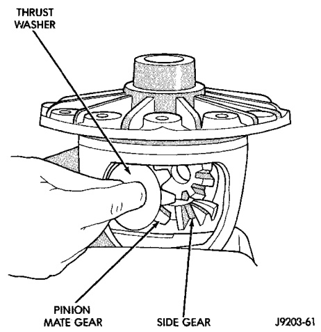
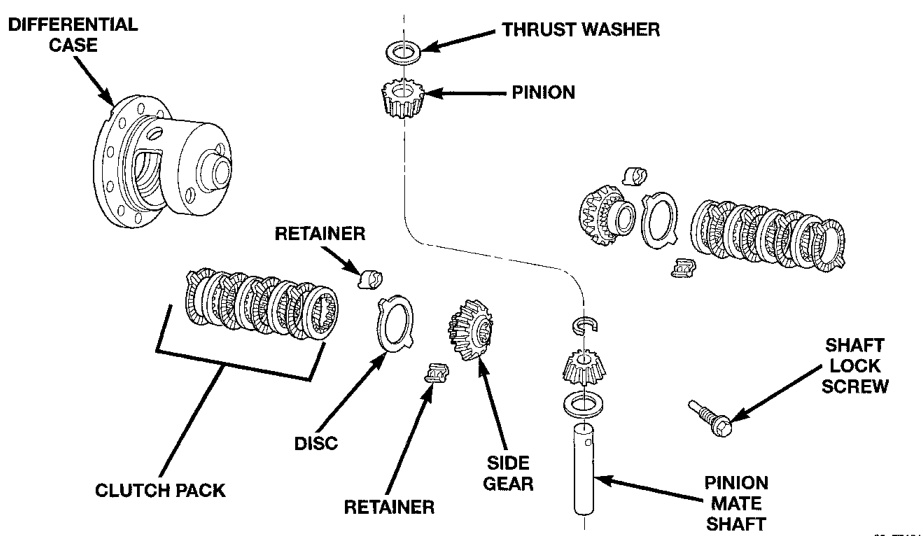

# DIFFERENTIAL AND DRIVELINE 3-75

## DISASSEMBLY AND ASSEMBLY (Continued)

*Fig. 38 Pinion Mate Gear Removal*
- Thrust Washer
- Pinion Mate Gear
- Side Gear

J9003-41

(4) Remove the differential side gears and thrust washers.

#### ASSEMBLY

(1) Install the differential side gears and thrust washers.

(2) Install the pinion mate gears and thrust washers.

(3) Install the pinion gear mate shaft.

(4) Align the hole in the pinion gear mate shaft with the hole in the differential case and install the pinion gear mate shaft lock screw.

(5) Lubricate all differential components with hypoid gear lubricant.

---

### 9 1/4 TRAC-LOK DIFFERENTIAL

The Trac-lok differential components are illustrated in (Fig. 39). Refer to this illustration during repair service.

#### DISASSEMBLY

(1) Clamp Side Gear Holding Tool 8136 in a vise.

(2) Position the differential case on Side Gear Holding Tool 8136 (Fig. 40).

(3) Remove ring gear, if necessary. Ring gear removal is necessary only if the ring gear is to be replaced. The Trac-lok differential can be serviced with the ring gear installed.

(4) Remove the pinion gear mate shaft lock screw (Fig. 41).

(5) Remove the pinion gear mate shaft. If necessary, use a drift and hammer (Fig. 42).

(6) Install and lubricate Step Plate 8139-2 (Fig. 43).

*Fig. 39 Trac-lok Differential Components*
- Differential Case
- Retainer
- Pinion
- Thrust Washer
- Disc
- Clutch Pack
- Side Gear
- Retainer
- Shaft Lock Screw
- Pinion Mate Shaft

8k47468
