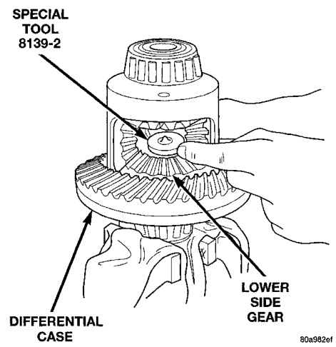
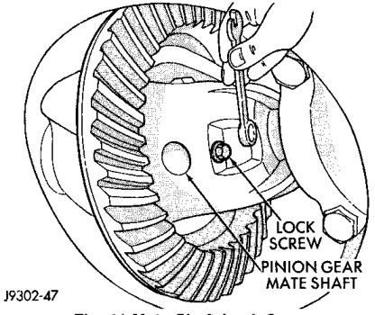
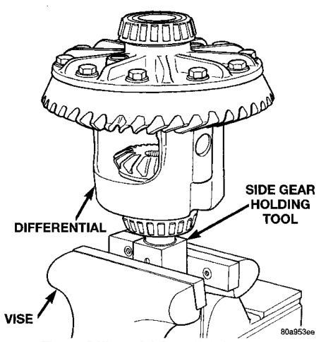
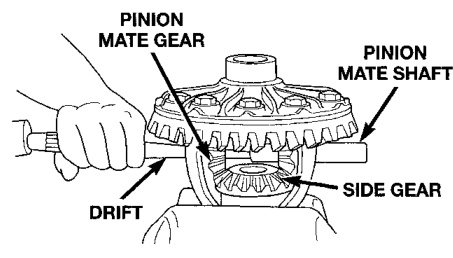
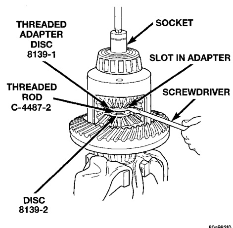

# DIFFERENTIAL AND DRIVELINE 3-76

## DISASSEMBLY AND ASSEMBLY (Continued)

*Fig. 41 Differential Case Holding Tool*
- Differential
- Side Gear Holding Tool
- Vise

*Fig. 42 Mate Shaft Lock Screw*
- Lock Screw
- Pinion Gear Mate Shaft

J9103-47

*Fig. 40 Mate Shaft Removal*
- Pinion Mate Gear
- Pinion Mate Shaft
- Drift
- Side Gear

8k47460

(7) Assemble Threaded Adapter 8139-1 into top side gear. Thread Forcing Screw C-4487-2 into adapter until it becomes centered in adapter plate.

(8) Position a small screw driver in slot of Threaded Adapter 8139-1 (Fig. 44) to prevent adapter from turning.

*Fig. 44 Step Plate Tool Installation*
- Special Tool 8139-2
- Differential
- Lower Side Gear

8k47461

*Fig. 43 Threaded Adapter Installation*
- Threaded Adapter 8139-1
- Socket
- Slot in Adapter
- Threaded Rod C-4487-2
- Disc 8139-2
- Screwdriver

8k47462
