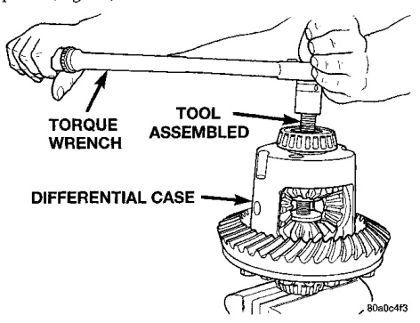
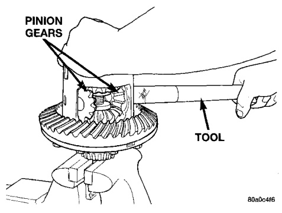
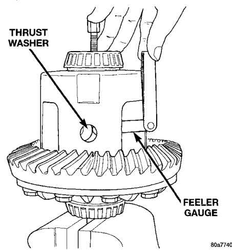
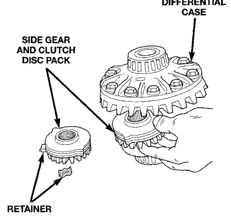

# DIFFERENTIAL AND DRIVELINE 3-77

## DISASSEMBLY AND ASSEMBLY (Continued)

(9) Tighten forcing screw tool 122 N·m (90 ft. lbs.) maximum to compress Belleville springs in clutch packs (Fig. 45).

*Fig. 46 Tighten Belleville Spring Compressor Tool*
- Torque Wrench
- Tool Assembled
- Differential Case

(10) Using an appropriate size feeler gauge, remove thrust washers from behind the pinion gears (Fig. 46).

*Fig. 45 Remove Pinion Gear Thrust Washer*
- Thrust Washer
- Feeler Gauge

8k47462

(11) Insert Turning Bar C-4487-4 in case (Fig. 47).

(12) Loosen the Forcing Screw C-4487-2 in small increments until the clutch pack tension is relieved and the differential case can be turned using Turning Bar C-4487-4.

(13) Rotate differential case until the pinion gears can be removed.

(14) Remove pinion gears from differential case.

*Fig. 47 Pinion Gear Removal*
- Pinion Gears
- Tool

(15) Remove Forcing Screw C-4487-2, Step Plate 8139-2, and Threaded Adapter 8139-1.

(16) Remove top side gear, clutch pack retainer, and clutch pack. Keep plates in correct order during removal (Fig. 48).

*Fig. 48 Side Gear & Clutch Disc Removal*
- Side Gear and Clutch Disc Pack
- Shaft

(17) Remove differential case from Side Gear Holding Tool 8136. Remove side gear, clutch pack retainer, and clutch pack. Keep plates in correct order during removal.

**NOTE:** The clutch discs are replaceable as complete sets only. If one clutch disc pack is damaged, both packs must be replaced.

#### ASSEMBLY

Lubricate each component with gear lubricant before assembly.
