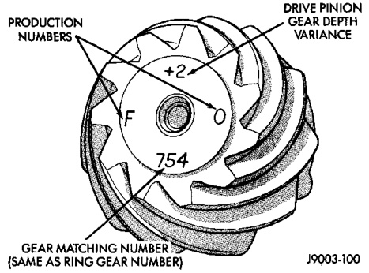

# DIFFERENTIAL AND DRIVELINE 3-79

## DISASSEMBLY AND ASSEMBLY (Continued)

(17) Lubricate all differential components with hypoid gear lubricant.

---

## CLEANING AND INSPECTION

### 9 1/4 AXLES

Wash differential components with cleaning solvent and dry with compressed air. Do not steam clean the differential components.

Wash bearings with solvent and towel dry, or dry with compressed air. DO NOT spin bearings with compressed air. Cup and bearing must be replaced as matched sets only.

Clean axle shaft tubes and oil channels in housing. Inspect for:

- Smooth appearance with no broken/dented surfaces on the bearing rollers or the roller contact surfaces.
- Bearing cups must not be distorted or cracked.
- Machined surfaces should be smooth and without any raised edges.
- Raised metal on shoulders of cup bores should be removed with a hand stone.
- Wear and damage to pinion gear mate shaft, pinion gears, side gears and thrust washers. Replace as a matched set only.
- Ring and pinion gear for worn and chipped teeth.
- Ring gear for damaged bolt threads. Replaced as a matched set only.
- Pinion yoke for cracks, worn splines, pitted areas, and a rough/corroded seal contact surface. Repair or replace as necessary.
- Pinion depth shims for damage and distortion. Install new shims if necessary.
- The differential case. Replace the case if cracked or damaged.
- The axle shaft C-clip locks for cracks and excessive wear. Replace them if necessary.
- Each threaded adjuster to determine if it rotates freely. If an adjuster binds, repair the damaged threads or replace the adjuster.
- The RWAL exciter ring for damage and missing teeth. Verify that the ring is fully seated to the differential case flange.

Polish each axle shaft sealing surface with No. 600 crocus cloth. This can remove slight surface damage. Do not reduce the diameter of the axle shaft seal contact surface. When polishing, the crocus cloth should be moved around the circumference of the shaft (not in-line with the shaft).

### TRAC-LOK

Clean all components in cleaning solvent. Dry components with compressed air. Inspect clutch pack plates for wear, scoring or damage. Replace both clutch packs if any one component in either pack is damaged. Inspect side and pinion gears. Replace any gear that is worn, cracked, chipped or damaged. Inspect differential case and pinion shaft. Replace if worn or damaged.

### PRESOAK PLATES AND DISC

Plates and discs with fiber coating (no grooves or lines) must be presoaked in Friction Modifier before assembly. Soak plates and discs for a minimum of 20 minutes.

---

## ADJUSTMENTS

### 9 1/4 AXLE PINION GEAR DEPTH

#### GENERAL INFORMATION

Ring and pinion gears are supplied as matched sets only. The identifying numbers for the ring and pinion gear are marked on the face of each gear (Fig. 52). A plus (+) number, minus (-) number or zero (0) is marked on the face of the pinion gear. This number is the amount (in thousandths of an inch) the depth varies from the standard depth setting of a pinion marked with a (0). The standard depth provides the best teeth contact pattern. Refer to Backlash and Contact Pattern Analysis Paragraph in this section for additional information.

*Fig. 52 Pinion Gear ID Numbers*
- Production Numbers
- Drive Pinion Gear Depth Variance
- Gear Matching Number (Same as Ring Gear Number)

J9003-100

Compensation for pinion depth variance is achieved with select shims. The shims are placed under the rear pinion bearing cone (Fig. 53).

If a new gear set is being installed, note the depth variance marked on both the original and replacement pinion gear. Add or subtract the thickness of the original depth shims to compensate for the difference in the depth variances. Refer to the Depth Variance charts.
