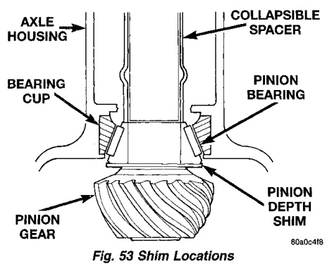
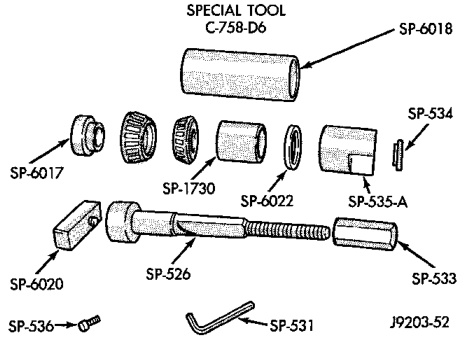

# DIFFERENTIAL AND DRIVELINE 3-80

## ADJUSTMENTS (Continued)

*Fig. 54 Shim Locations*
- Axle Housing
- Collapsible Spacer
- Bearing Cup
- Pinion Bearing
- Pinion Depth Shim

Note where Old and New Pinion Marking columns intersect. Intersecting figure represents plus or minus amount needed.

Note the marked number on the face of the drive pinion gear (-1, -2, 0, +1, +2, etc.). The numbers represent thousands of an inch deviation from the standard. If the number is negative, add that value to the required thickness of the depth shim(s). If the number is positive, subtract that value from the thickness of the depth shim(s). If the number is 0 no change is necessary. Refer to the Pinion Gear Depth Variance Chart.

---

### PINION DEPTH MEASUREMENT AND ADJUSTMENT

(1) Install front bearing cup. Use Installer D-129 and Handle C-4171.

(2) Install rear bearing cup. Use Installer C-4310 and Handle C-4171.

(3) Use Pinion Gear Adjustment Gauge Set C-758-D6 (Fig. 54).

(4) Position Spacer SP-6017 over Shaft SP-526.

(5) Position pinion rear bearing on shaft.

(6) Position tools (with bearing) in the housing.

(7) Install Sleeve SP-1730.

(8) Install pinion front bearing.

(9) Install Spacer SP-6022.

(10) Install Sleeve SP-535A, Washer SP-534, and Nut SP-533.

*Fig. 55 9 1/4 Axle Pinion Adjustment Tools*
- Special Tool SP-6016

(11) Tighten the nut to seat the pinion bearings in the housing. Allow the sleeve to turn several times during tightening to prevent brinelling bearing cups or bearings.

---

### PINION GEAR DEPTH VARIANCE

| Original Pinion Gear Depth Variance | Replacement Pinion Gear Depth Variance |||||||||
|-----|-------|-------|-------|-------|-------|-------|-------|-------|-------|
|     | **-4** | **-3** | **-2** | **-1** | **0** | **+1** | **+2** | **+3** | **+4** |
| **+4** | +0.008 | +0.007 | +0.006 | +0.005 | +0.004 | +0.003 | +0.002 | +0.001 | 0 |
| **+3** | +0.007 | +0.006 | +0.005 | +0.004 | +0.003 | +0.002 | +0.001 | 0 | -0.001 |
| **+2** | +0.006 | +0.005 | +0.004 | +0.003 | +0.002 | +0.001 | 0 | -0.001 | -0.002 |
| **+1** | +0.005 | +0.004 | +0.003 | +0.002 | +0.001 | 0 | -0.001 | -0.002 | -0.003 |
| **0** | +0.004 | +0.003 | +0.002 | +0.001 | 0 | -0.001 | -0.002 | -0.003 | -0.004 |
| **-1** | +0.003 | +0.002 | +0.001 | 0 | -0.001 | -0.002 | -0.003 | -0.004 | -0.005 |
| **-2** | +0.002 | +0.001 | 0 | -0.001 | -0.002 | -0.003 | -0.004 | -0.005 | -0.006 |
| **-3** | +0.001 | 0 | -0.001 | -0.002 | -0.003 | -0.004 | -0.005 | -0.006 | -0.007 |
| **-4** | 0 | -0.001 | -0.002 | -0.003 | -0.004 | -0.005 | -0.006 | -0.007 | -0.008 |

J8902-46
