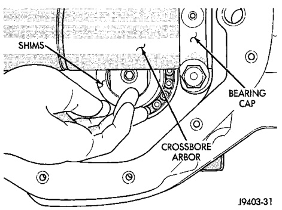
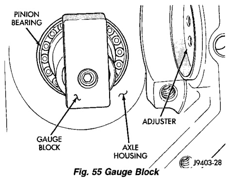
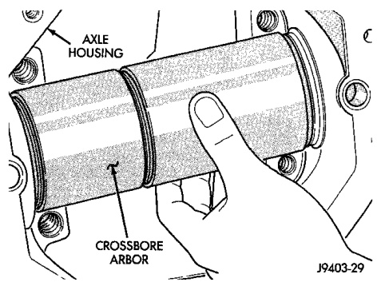

# DIFFERENTIAL AND DRIVELINE 3-81

## ADJUSTMENTS (Continued)

(12) Loosen the compression nut tool.

(13) Lubricate the pinion gear front and rear bearings with gear lubricant.

(14) Re-tighten the compression nut tool to 1-3 N·m (15-25 in. lbs.) torque.

(15) Rotate the pinion gear several complete revolutions to align the bearing rollers.

(16) Install Gauge Block (Fig. 55).

*Fig. 55 Gauge Block*
- Tool
- Gauge Block
- Adjuster
- Axle Housing

J9403-3

(17) Install Gauge Block SP-6020 at the end of SP-526.

(18) Install Cap Screw SP-536 and tighten with Wrench SP-531.

(19) Position Crossbore Arbor SP-6018 in the differential housing (Fig. 56).

*Fig. 56 Crossbore Arbor*
- Axle Housing
- Crossbore Arbor

J9403-29

(20) Center the tool.

(21) Position the bearing caps on the arbor tool.

(22) Install the attaching bolts.

(23) Tighten the cap bolts to 14 N·m (10 ft. lbs.).

(24) Trial fit depth shim(s) between the crossbore arbor and gauge block (Fig. 57). The depth shim(s) fit must be snug but not tight (drag friction of a feeler gauge blade).

*Fig. 57 Depth Shim(s) Selection*
- Shims
- Bearing Cap
- Crossbore Arbor

J9403-31

(25) Select a shim equal to the shim selected above plus the drive pinion gear depth variance number marked on the face of the pinion gear (Fig. 52) using the opposite sign on the variance number. For example, if the depth variance is -2, add +0.002 in. to the dial indicator reading.

**NOTE:** Depth shims are available in 0.001-inch increments from 0.020 inch to 0.038 inch.

(26) Remove the tools from the differential housing.

---

### DIFFERENTIAL BEARING PRELOAD AND GEAR BACKLASH

The following must be considered when adjusting bearing preload and gear backlash:

- The maximum ring gear backlash variation is 0.003 inch (0.076 mm).
- Mark the gears so the same teeth are meshed during all backlash measurements.
- Maintain the torque while adjusting the bearing preload and ring gear backlash.
- Excessive adjuster torque will introduce a high bearing load and cause premature bearing failure. Insufficient adjuster torque can result in excessive differential case free-play and ring gear noise.
- Insufficient adjuster torque will not support the ring gear correctly and can cause excessive differential case free-play and ring gear noise.

**NOTE:** The differential bearing cups will not always immediately follow the threaded adjusters as they are moved during adjustment. To ensure accurate bearing cup responses to the adjustments:

- Maintain the gear teeth engaged (meshed) as marked.
- The bearings must be seated by rapidly rotating the pinion gear a half turn back and forth.
- Do this five to ten times each time the threaded adjusters are adjusted.
